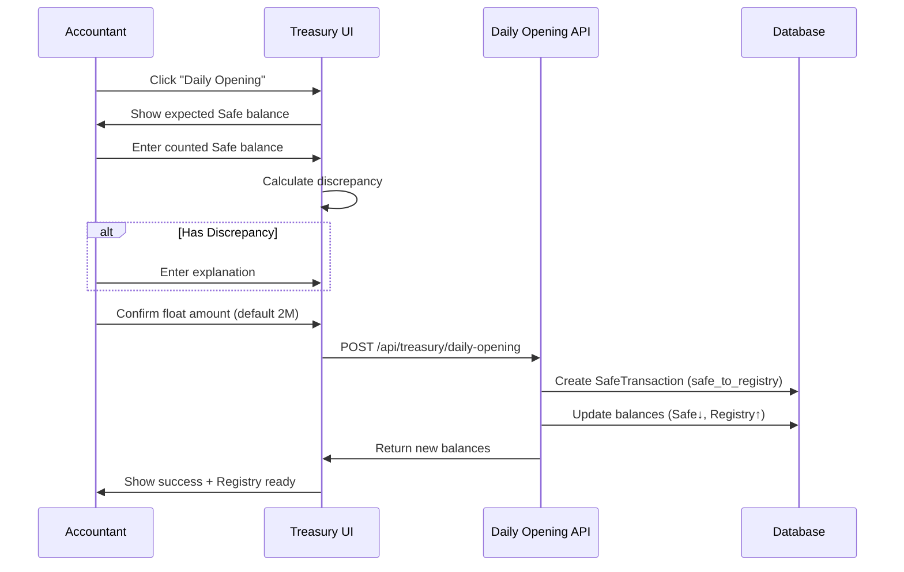
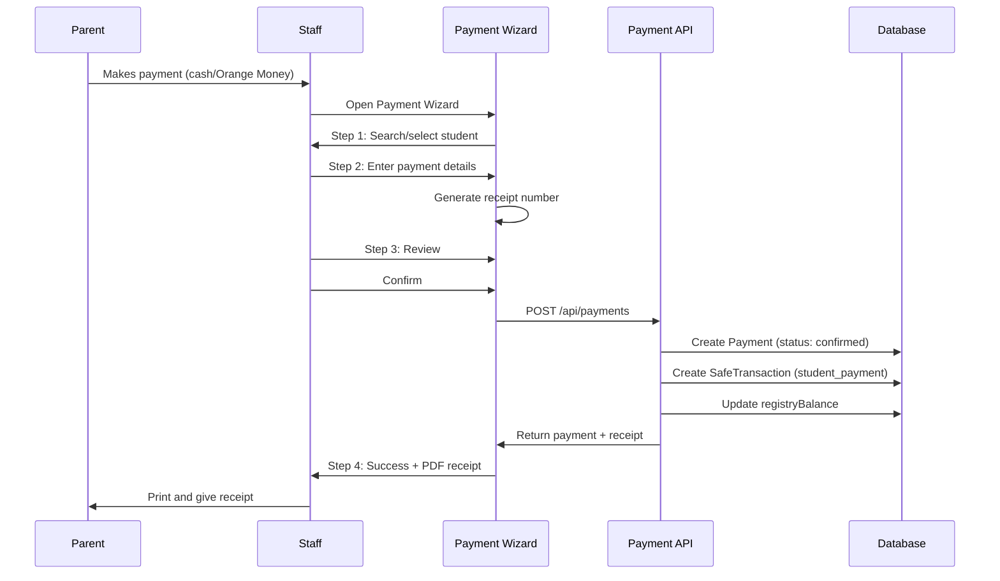
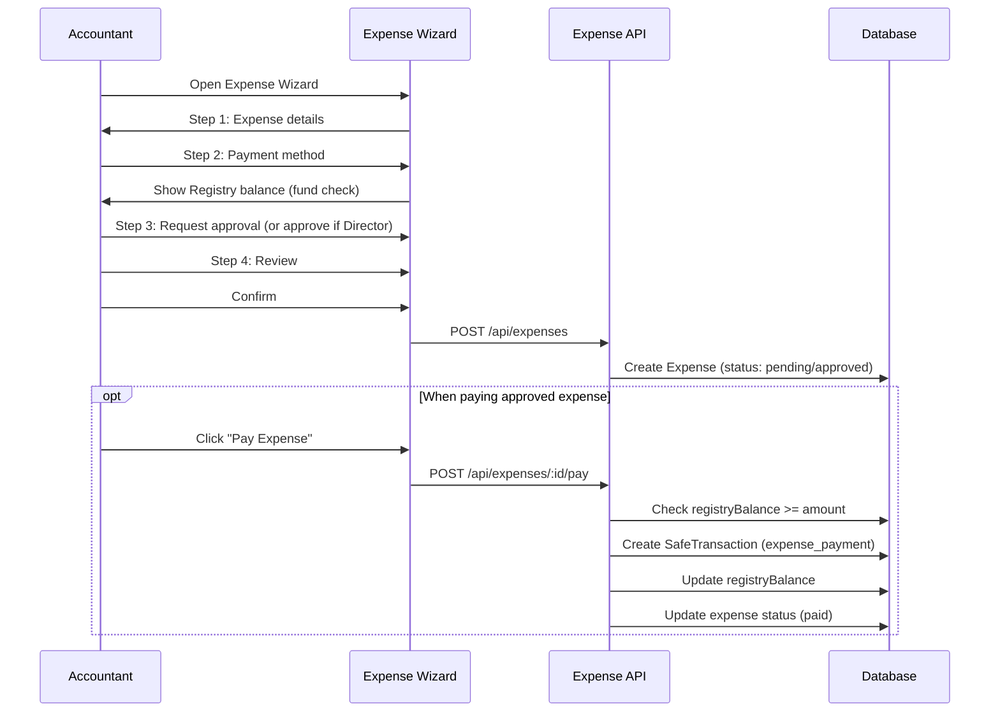
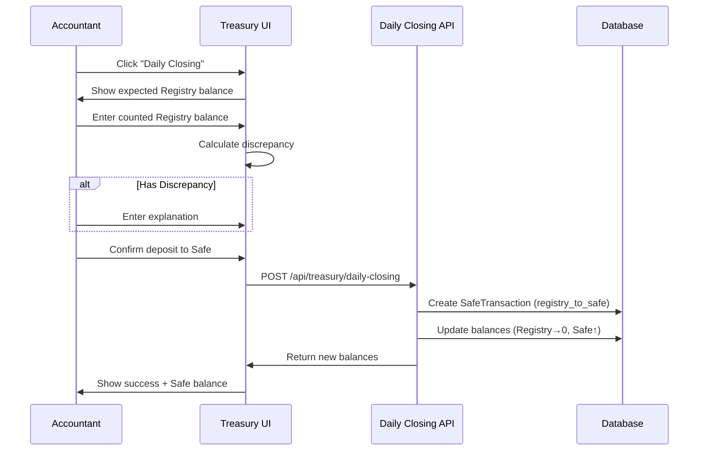

# Registry-Based Cash Management System - Technical Design Document

**Date:** 2026-01-11
**Status:** Planning
**Version:** 1.0
**Author:** System Architecture Team

---

## Executive Summary

This document outlines the transformation of the school's accounting system to accurately model the real-world cash flow process: **Registry → Safe → Bank**. The current system incorrectly treats the safe as an active cash register, when in reality there's a separate Registry (working cash box) used for daily operations.

### Key Changes

1. **Add Registry tracking** to database and UI
2. **Update payment flow** to record payments into Registry (not Safe)
3. **Update expense flow** to pay expenses from Registry (not Safe)
4. **Create daily operations** for opening (Safe → Registry) and closing (Registry → Safe)
5. **Implement Payment Wizard** with 3-step flow and PDF receipt generation
6. **Implement Expense Wizard** with approval workflow

---

## Table of Contents

1. [Problem Statement](#problem-statement)
2. [Current vs. Proposed Architecture](#current-vs-proposed-architecture)
3. [Cash Flow Process](#cash-flow-process)
4. [Database Schema Changes](#database-schema-changes)
5. [API Design](#api-design)
6. [UI/UX Design](#uiux-design)
7. [Business Logic](#business-logic)
8. [Security & Authorization](#security--authorization)
9. [Performance Considerations](#performance-considerations)
10. [Migration Strategy](#migration-strategy)

---

## 1. Problem Statement

### Current System (Incorrect Model)

```
Payment → Safe (incorrect - money doesn't go directly to safe)
Expense → Safe (incorrect - expenses aren't paid from safe)
```

**Issues:**
- ❌ No concept of working cash register (Registry)
- ❌ Safe is treated as active transaction location
- ❌ Missing daily opening/closing reconciliation
- ❌ No tracking of float management
- ❌ Cannot model real accountant workflow

### Real-World Process (Correct Model)

```
Morning:
  Safe → Registry (Withdraw 2,000,000 float)

During Day:
  Payment → Registry (Student pays tuition)
  Registry → Expense (Pay small expenses)

Evening:
  Registry → Safe (Deposit all Registry balance)

Periodic:
  Safe → Bank (When Safe exceeds threshold)
```

**Requirements:**
- ✅ Track Registry separately from Safe
- ✅ Payments go into Registry
- ✅ Expenses paid from Registry
- ✅ Daily opening/closing workflows
- ✅ Float management (standard 2M GNF)
- ✅ Complete audit trail

---

## 2. Current vs. Proposed Architecture

### 2.1 Current Database Schema

```prisma
model SafeBalance {
  id                 String    @id
  safeBalance        Int       // WRONG: Mixed Registry + Safe
  bankBalance        Int
  mobileMoneyBalance Int
  safeThresholdMin   Int       // Not used correctly
  safeThresholdMax   Int       // For bank deposit trigger
}
```

### 2.2 Proposed Database Schema

```prisma
model TreasuryBalance {
  id                     String    @id
  registryBalance        Int       // NEW: Active cash register
  safeBalance            Int       // Secure overnight storage
  bankBalance            Int       // Bank account
  mobileMoneyBalance     Int       // Orange Money account

  // Settings
  registryFloatAmount    Int       // NEW: Standard daily float (2M)
  safeThresholdMax       Int       // Trigger for bank deposit

  lastVerifiedAt         DateTime?
  lastVerifiedBy         String?
  createdAt              DateTime
  updatedAt              DateTime
}
```

### 2.3 Transaction Type Changes

```prisma
enum SafeTransactionType {
  // Existing types
  student_payment
  activity_payment
  expense_payment
  bank_deposit
  bank_withdrawal
  mobile_money_income
  mobile_money_payment
  // ... other existing types

  // NEW types for Registry operations
  registry_to_safe         // Evening deposit
  safe_to_registry         // Morning withdrawal (float)
  registry_adjustment      // Manual corrections
}
```

---

## 3. Cash Flow Process

### 3.1 Daily Morning Opening

**Actor:** Accountant
**Time:** Start of day (~8:00 AM)



**Balance Changes:**
- `safeBalance` decreases by float amount (e.g., -2,000,000)
- `registryBalance` increases by float amount (e.g., +2,000,000)

### 3.2 Payment Recording

**Actor:** Secretary/Accountant
**Time:** Throughout day



**Balance Changes (Cash Payment):**
- `registryBalance` increases by payment amount
- Status is immediately `confirmed` (no review needed)

**Balance Changes (Orange Money):**
- `mobileMoneyBalance` increases by payment amount
- Status is immediately `confirmed`

### 3.3 Expense Payment

**Actor:** Accountant
**Time:** Throughout day (as needed)



**Balance Changes:**
- `registryBalance` decreases by expense amount
- Only allowed if sufficient funds in Registry

### 3.4 Daily Evening Closing

**Actor:** Accountant
**Time:** End of day (~6:00 PM)



**Balance Changes:**
- `registryBalance` becomes 0
- `safeBalance` increases by Registry balance

### 3.5 Periodic Bank Deposit

**Actor:** Director/Accountant
**Time:** When Safe exceeds threshold (e.g., 20M)

**Process:** (Already implemented, no changes needed)
- Accountant carries cash to bank
- Creates BankTransfer (type: deposit)
- `safeBalance` decreases
- `bankBalance` increases

---

## 4. Database Schema Changes

### 4.1 Rename SafeBalance → TreasuryBalance

**Reason:** More accurate name reflecting multiple balance types

```sql
-- Migration: Rename table
ALTER TABLE "SafeBalance" RENAME TO "TreasuryBalance";
```

### 4.2 Add Registry Columns

```sql
-- Add registryBalance column
ALTER TABLE "TreasuryBalance"
ADD COLUMN "registryBalance" INTEGER DEFAULT 0 NOT NULL;

-- Add registryFloatAmount column
ALTER TABLE "TreasuryBalance"
ADD COLUMN "registryFloatAmount" INTEGER DEFAULT 2000000 NOT NULL;

-- Remove unused safeThresholdMin (was never used correctly)
ALTER TABLE "TreasuryBalance"
DROP COLUMN "safeThresholdMin";
```

### 4.3 Update SafeTransaction Schema

```sql
-- Add registryBalanceAfter for tracking
ALTER TABLE "SafeTransaction"
ADD COLUMN "registryBalanceAfter" INTEGER;
```

### 4.4 Add New Transaction Types

```sql
-- Already handled by Prisma enum, no SQL needed
-- New types: registry_to_safe, safe_to_registry, registry_adjustment
```

### 4.5 Complete Updated Schema

```prisma
model TreasuryBalance {
  id                     String    @id @default(cuid())
  registryBalance        Int       @default(0)
  safeBalance            Int       @default(0)
  bankBalance            Int       @default(0)
  mobileMoneyBalance     Int       @default(0)
  registryFloatAmount    Int       @default(2000000)
  safeThresholdMax       Int       @default(20000000)
  lastVerifiedAt         DateTime?
  lastVerifiedBy         String?
  syncVersion            Int       @default(0)
  createdAt              DateTime  @default(now())
  updatedAt              DateTime  @updatedAt
  verifier               User?     @relation("SafeVerifier", fields: [lastVerifiedBy], references: [id])

  @@index([lastVerifiedBy])
}

model SafeTransaction {
  id                      String              @id @default(cuid())
  type                    SafeTransactionType
  direction               CashDirection
  amount                  Int
  registryBalanceAfter    Int?                // NEW
  safeBalanceAfter        Int
  bankBalanceAfter        Int?
  mobileMoneyBalanceAfter Int?
  description             String?
  referenceType           String?
  referenceId             String?
  studentId               String?
  payerName               String?
  beneficiaryName         String?
  category                String?
  receiptNumber           String?             @unique
  recordedBy              String
  recordedAt              DateTime            @default(now())
  notes                   String?
  isReversal              Boolean             @default(false)
  reversalReason          String?
  reversedBy              String?
  reversedAt              DateTime?
  originalTransactionId   String?
  syncVersion             Int                 @default(0)
  createdAt               DateTime            @default(now())
  updatedAt               DateTime            @updatedAt
  recorder                User                @relation("SafeTransactionRecorder", fields: [recordedBy], references: [id])
  student                 Student?            @relation(fields: [studentId], references: [id])
  originalTransaction     SafeTransaction?    @relation("ReversalOriginal", fields: [originalTransactionId], references: [id], onDelete: Restrict, onUpdate: Restrict)
  reversals               SafeTransaction[]   @relation("ReversalOriginal")

  @@index([recordedAt])
  @@index([type])
  @@index([direction])
  @@index([referenceType, referenceId])
  @@index([recordedBy])
  @@index([studentId])
  @@index([isReversal])
  @@index([originalTransactionId])
}

enum SafeTransactionType {
  student_payment
  activity_payment
  other_income
  expense_payment
  bank_deposit
  bank_withdrawal
  adjustment
  mobile_money_income
  mobile_money_payment
  mobile_money_fee
  reversal_student_payment
  reversal_expense_payment
  reversal_bank_deposit
  reversal_mobile_money
  registry_to_safe              // NEW
  safe_to_registry              // NEW
  registry_adjustment           // NEW
}
```

---

## 5. API Design

### 5.1 Modified Endpoints

#### POST /api/payments (MODIFIED)

**Changes:** Use `registryBalance` instead of `safeBalance`

**Request:**
```json
{
  "enrollmentId": "string",
  "amount": number,
  "method": "cash" | "orange_money",
  "receiptNumber": "string",
  "transactionRef": "string?",
  "notes": "string?"
}
```

**Response:**
```json
{
  "id": "string",
  "amount": number,
  "method": "cash",
  "status": "confirmed",
  "receiptNumber": "string",
  "recordedAt": "datetime",
  "newRegistryBalance": number,
  "enrollment": {
    "id": "string",
    "student": {
      "firstName": "string",
      "lastName": "string"
    }
  }
}
```

**Business Logic Changes:**
```typescript
// OLD (incorrect)
newSafeBalance = currentBalance.safeBalance + amount

// NEW (correct)
if (method === "cash") {
  newRegistryBalance = currentBalance.registryBalance + amount
  // Update: registryBalance
} else if (method === "orange_money") {
  newMobileMoneyBalance = currentBalance.mobileMoneyBalance + amount
  // Update: mobileMoneyBalance
}
```

#### POST /api/expenses/[id]/pay (MODIFIED)

**Changes:** Check and deduct from `registryBalance`

**Request:**
```json
{
  "notes": "string?"
}
```

**Response:**
```json
{
  "message": "Expense paid successfully",
  "expense": { ... },
  "newRegistryBalance": number
}
```

**Business Logic Changes:**
```typescript
// OLD (incorrect)
if (currentBalance.safeBalance < amount) {
  throw new Error("Insufficient funds in safe")
}
newSafeBalance = currentBalance.safeBalance - amount

// NEW (correct)
if (method === "cash") {
  if (currentBalance.registryBalance < amount) {
    throw new Error("Insufficient funds in registry")
  }
  newRegistryBalance = currentBalance.registryBalance - amount
  // Update: registryBalance
}
```

### 5.2 New Endpoints

#### POST /api/treasury/daily-opening

**Purpose:** Morning verification and float withdrawal

**Authorization:** director, accountant

**Request:**
```json
{
  "countedSafeBalance": number,
  "floatAmount": number,
  "notes": "string?"
}
```

**Response:**
```json
{
  "success": true,
  "discrepancy": number,
  "safeBalance": number,
  "registryBalance": number,
  "transaction": {
    "id": "string",
    "type": "safe_to_registry",
    "amount": number,
    "recordedAt": "datetime"
  }
}
```

**Validation:**
- Cannot open if already opened today
- Counted balance must be reasonable (within 10% of expected)
- Float amount must be positive

**Algorithm:**
```typescript
1. Get current TreasuryBalance
2. Calculate discrepancy = countedSafeBalance - currentBalance.safeBalance
3. If discrepancy > 0 OR discrepancy < -100000:
   - Require notes explaining discrepancy
4. Check if already opened today:
   - Query SafeTransaction for type=safe_to_registry today
   - If exists, return error
5. Create SafeTransaction:
   - type: safe_to_registry
   - direction: out (from safe perspective)
   - amount: floatAmount
   - safeBalanceAfter: countedSafeBalance - floatAmount
   - registryBalanceAfter: floatAmount
6. Update TreasuryBalance:
   - safeBalance = countedSafeBalance - floatAmount
   - registryBalance = floatAmount
7. Return success with new balances
```

#### POST /api/treasury/daily-closing

**Purpose:** Evening reconciliation and deposit to safe

**Authorization:** director, accountant

**Request:**
```json
{
  "countedRegistryBalance": number,
  "notes": "string?"
}
```

**Response:**
```json
{
  "success": true,
  "discrepancy": number,
  "expectedBalance": number,
  "safeBalance": number,
  "registryBalance": 0,
  "transaction": {
    "id": "string",
    "type": "registry_to_safe",
    "amount": number,
    "recordedAt": "datetime"
  }
}
```

**Validation:**
- Cannot close if already closed today
- Counted balance must be reasonable

**Algorithm:**
```typescript
1. Get current TreasuryBalance
2. Calculate expected = registryBalance (from database)
3. Calculate discrepancy = countedRegistryBalance - expected
4. If abs(discrepancy) > 10000:
   - Require notes explaining discrepancy
5. Check if already closed today:
   - Query SafeTransaction for type=registry_to_safe today
   - If exists, return error
6. Create SafeTransaction:
   - type: registry_to_safe
   - direction: in (from safe perspective)
   - amount: countedRegistryBalance
   - registryBalanceAfter: 0
   - safeBalanceAfter: currentBalance.safeBalance + countedRegistryBalance
7. Update TreasuryBalance:
   - safeBalance += countedRegistryBalance
   - registryBalance = 0
8. Return success with new balances
```

#### GET /api/students/search

**Purpose:** Fast student search for payment wizard

**Authorization:** all authenticated users

**Query Parameters:**
```
?q=search_term&limit=10&includeEnrollment=true
```

**Response:**
```json
{
  "students": [
    {
      "id": "string",
      "studentNumber": "string",
      "firstName": "string",
      "lastName": "string",
      "photoUrl": "string?",
      "currentEnrollment": {
        "id": "string",
        "grade": { "name": "string" },
        "status": "completed",
        "tuitionFee": number,
        "totalPaid": number,
        "remainingBalance": number,
        "paymentProgress": 0.75
      }
    }
  ],
  "total": number
}
```

**Search Logic:**
```typescript
WHERE (
  studentNumber ILIKE '%search%'
  OR firstName ILIKE '%search%'
  OR lastName ILIKE '%search%'
  OR CONCAT(firstName, ' ', lastName) ILIKE '%search%'
)
AND status = 'active'
ORDER BY studentNumber ASC
LIMIT 10
```

#### GET /api/payments/next-receipt-number (EXISTING, but verify)

**Purpose:** Generate next receipt number

**Response:**
```json
{
  "receiptNumber": "CAISSE-20260111-REC-0001"
}
```

**Format:** `CAISSE-YYYYMMDD-REC-NNNN`

---

## 6. UI/UX Design

### 6.1 Payment Wizard

**Location:** `app/ui/components/accounting/payment-wizard/PaymentWizard.tsx`

**Flow:**

```
Step 1: Student Selection
┌─────────────────────────────────────────┐
│  🔍 Search Student                      │
│  ┌─────────────────────────────────┐   │
│  │ Student number or name...       │   │
│  └─────────────────────────────────┘   │
│                                         │
│  Quick Filters:                         │
│  [All Grades ▾] [Active Only]          │
│                                         │
│  Results:                               │
│  ┌─────────────────────────────────┐   │
│  │ 📷 John Doe • ST-2024-001       │ →│
│  │    Grade: 6eme • Balance: 2.5M  │   │
│  └─────────────────────────────────┘   │
│  ┌─────────────────────────────────┐   │
│  │ 📷 Jane Smith • ST-2024-002     │ →│
│  └─────────────────────────────────┘   │
└─────────────────────────────────────────┘

Step 2: Payment Details
┌─────────────────────────────────────────┐
│  Student: John Doe (6eme)               │
│                                         │
│  Payment Type:                          │
│  [Tuition] [Activity]                   │
│                                         │
│  Payment Progress:                      │
│  ▓▓▓▓▓▓▓▓▓▓░░░░░░ 75%                  │
│  Paid: 7,500,000 / 10,000,000 GNF     │
│  Remaining: 2,500,000 GNF              │
│                                         │
│  Payment Method:                        │
│  ● Cash  ○ Orange Money                │
│                                         │
│  Amount: [2,500,000] GNF               │
│  Receipt #: CAISSE-20260111-REC-0001   │
│                                         │
│  Notes: [Optional]                      │
│                                         │
│  [← Back]              [Review →]      │
└─────────────────────────────────────────┘

Step 3: Review
┌─────────────────────────────────────────┐
│  Review Payment                         │
│                                         │
│  Student: John Doe (ST-2024-001)       │
│  Grade: 6eme                            │
│  Payment Type: Tuition                  │
│  Method: Cash                           │
│  Amount: 2,500,000 GNF                 │
│  Receipt: CAISSE-20260111-REC-0001     │
│                                         │
│  ✓ Confirm payment received             │
│                                         │
│  [← Back]        [Confirm Payment]     │
└─────────────────────────────────────────┘

Step 4: Success
┌─────────────────────────────────────────┐
│       ✓ Payment Recorded!               │
│                                         │
│  Receipt: CAISSE-20260111-REC-0001     │
│  Amount: 2,500,000 GNF                 │
│  Date: Jan 11, 2026 2:30 PM           │
│                                         │
│  Payment Progress:                      │
│  ▓▓▓▓▓▓▓▓▓▓▓▓▓▓▓▓ 100%                │
│  ✓ Fully Paid                          │
│                                         │
│  [📄 Print Receipt] [Record Another]   │
└─────────────────────────────────────────┘
```

**Design Principles:**
- Leverage `frontend-design-gspn` skill patterns
- Use enrollment wizard visual style
- Smooth Framer Motion transitions
- Progressive disclosure (only show relevant fields)
- Clear visual hierarchy

### 6.2 Expense Wizard

**Location:** `app/ui/components/accounting/expense-wizard/ExpenseWizard.tsx`

**Flow:**

```
Step 1: Expense Details
┌─────────────────────────────────────────┐
│  Record Expense                         │
│                                         │
│  Category: [Supplies ▾]                │
│  Description: [Required]                │
│  Amount: [______] GNF                   │
│  Vendor: [Optional]                     │
│  Date: [Jan 11, 2026]                  │
│  Receipt: [Upload PDF/Image]           │
│                                         │
│  [← Cancel]               [Next →]     │
└─────────────────────────────────────────┘

Step 2: Payment Method
┌─────────────────────────────────────────┐
│  Payment Method                         │
│                                         │
│  ● Cash                                 │
│  Registry Balance: 2,500,000 GNF       │
│  After payment: 2,250,000 GNF          │
│                                         │
│  ○ Orange Money                         │
│  ○ Bank Transfer                        │
│                                         │
│  [← Back]               [Next →]       │
└─────────────────────────────────────────┘

Step 3: Approval
┌─────────────────────────────────────────┐
│  Approval Required                      │
│                                         │
│  [If Director]                          │
│  ✓ Approve and pay immediately          │
│                                         │
│  [If Accountant]                        │
│  This expense requires Director         │
│  approval before payment.               │
│                                         │
│  Notes for approval: [Optional]         │
│                                         │
│  [← Back]          [Submit Request]    │
└─────────────────────────────────────────┘

Step 4: Success
┌─────────────────────────────────────────┐
│       ✓ Expense Recorded!               │
│                                         │
│  Expense #: EXP-2026-001               │
│  Amount: 250,000 GNF                   │
│  Status: Pending Approval              │
│                                         │
│  The Director will be notified.         │
│                                         │
│  [Record Another] [View Expenses]      │
└─────────────────────────────────────────┘
```

### 6.3 Treasury Dashboard Updates

**Location:** `app/ui/app/treasury/page.tsx` (to be moved to `/accounting/safe`)

**New Layout:**

```
┌─────────────────────────────────────────────────────────┐
│  CASH FLOW OVERVIEW                                     │
│  ┌─────────────┐  ┌─────────────┐  ┌─────────────┐    │
│  │ 📦 Registry │  │ 🔒 Safe     │  │ 🏦 Bank     │    │
│  │ 2,500,000   │  │ 15,000,000  │  │ 420,000,000 │    │
│  │ GNF         │  │ GNF         │  │ GNF         │    │
│  │ 🟢 Active   │  │ 🟡 Medium   │  │ 🟢 Secure   │    │
│  └─────────────┘  └─────────────┘  └─────────────┘    │
│                                                         │
│  ┌─────────────────────────────────────────────────┐   │
│  │ 📱 Mobile Money: 27,500,000 GNF                │   │
│  └─────────────────────────────────────────────────┘   │
└─────────────────────────────────────────────────────────┘

┌─────────────────────────────────────────────────────────┐
│  DAILY OPERATIONS                                       │
│  [🌅 Daily Opening] [🌙 Daily Closing] [🏦 Bank Deposit]│
└─────────────────────────────────────────────────────────┘

┌─────────────────────────────────────────────────────────┐
│  QUICK ACTIONS                                          │
│  [💰 Record Payment] [💳 Record Expense]               │
└─────────────────────────────────────────────────────────┘

┌─────────────────────────────────────────────────────────┐
│  TODAY'S ACTIVITY                                       │
│  Registry Transactions: 15                              │
│  Total In: 5,000,000 GNF | Total Out: 250,000 GNF     │
│                                                         │
│  Recent Transactions:                                   │
│  [Transaction list...]                                  │
└─────────────────────────────────────────────────────────┘
```

---

## 7. Business Logic

### 7.1 Balance Calculation Rules

```typescript
// Registry balance (active cash register)
registryBalance =
  opening_float +
  sum(cash_payments_today) -
  sum(cash_expenses_today) +
  adjustments

// Safe balance (secure storage)
safeBalance =
  previous_balance +
  sum(registry_deposits) -
  sum(registry_withdrawals) -
  sum(bank_deposits) +
  sum(bank_withdrawals)

// Bank balance
bankBalance =
  previous_balance +
  sum(bank_deposits) -
  sum(bank_withdrawals)

// Mobile Money balance
mobileMoneyBalance =
  previous_balance +
  sum(orange_money_payments) -
  sum(orange_money_expenses) -
  sum(fees)
```

### 7.2 Receipt Number Generation

**Format:** `CAISSE-YYYYMMDD-REC-NNNN`

**Algorithm:**
```typescript
function generateReceiptNumber(): string {
  const today = new Date()
  const datePrefix = today.toISOString().slice(0, 10).replace(/-/g, "")

  // Count today's transactions
  const count = await prisma.safeTransaction.count({
    where: {
      recordedAt: {
        gte: startOfDay(today),
        lte: endOfDay(today),
      },
      type: {
        in: ["student_payment", "activity_payment", "other_income"]
      }
    },
  })

  const sequence = String(count + 1).padStart(4, "0")
  return `CAISSE-${datePrefix}-REC-${sequence}`
}
```

### 7.3 Payment Validation Rules

```typescript
// 1. Enrollment must exist and be in valid status
validStatuses = ["submitted", "needs_review", "completed"]

// 2. Amount must not exceed remaining balance
remainingBalance = tuitionFee - totalPaid
if (amount > remainingBalance) {
  throw new Error("Amount exceeds remaining balance")
}

// 3. Receipt number must be unique
if (await prisma.payment.findUnique({ where: { receiptNumber } })) {
  throw new Error("Receipt number already exists")
}

// 4. Amount must be positive
if (amount <= 0) {
  throw new Error("Amount must be positive")
}
```

### 7.4 Expense Validation Rules

```typescript
// 1. Check Registry funds (for cash)
if (method === "cash") {
  if (treasuryBalance.registryBalance < amount) {
    throw new Error("Insufficient funds in registry")
  }
}

// 2. Check Mobile Money funds
if (method === "orange_money") {
  if (treasuryBalance.mobileMoneyBalance < amount) {
    throw new Error("Insufficient mobile money balance")
  }
}

// 3. Expense must be approved before payment
if (expense.status !== "approved") {
  throw new Error("Expense must be approved before payment")
}

// 4. Amount must be positive
if (amount <= 0) {
  throw new Error("Amount must be positive")
}
```

### 7.5 Daily Operation Rules

**Opening Rules:**
```typescript
// 1. Cannot open twice in same day
const existingOpening = await prisma.safeTransaction.findFirst({
  where: {
    type: "safe_to_registry",
    recordedAt: {
      gte: startOfDay(today),
      lte: endOfDay(today),
    },
  },
})
if (existingOpening) {
  throw new Error("Already opened today")
}

// 2. Discrepancy must be reasonable or explained
const discrepancy = countedBalance - expectedBalance
if (abs(discrepancy) > 100000 && !notes) {
  throw new Error("Large discrepancy requires explanation")
}

// 3. Float amount must be positive
if (floatAmount <= 0) {
  throw new Error("Float amount must be positive")
}

// 4. Safe must have sufficient funds
if (countedBalance < floatAmount) {
  throw new Error("Insufficient funds in safe for float withdrawal")
}
```

**Closing Rules:**
```typescript
// 1. Cannot close twice in same day
const existingClosing = await prisma.safeTransaction.findFirst({
  where: {
    type: "registry_to_safe",
    recordedAt: {
      gte: startOfDay(today),
      lte: endOfDay(today),
    },
  },
})
if (existingClosing) {
  throw new Error("Already closed today")
}

// 2. Must be opened before closing
const todayOpening = await prisma.safeTransaction.findFirst({
  where: {
    type: "safe_to_registry",
    recordedAt: {
      gte: startOfDay(today),
      lte: endOfDay(today),
    },
  },
})
if (!todayOpening) {
  throw new Error("Must open registry before closing")
}

// 3. Discrepancy must be reasonable or explained
const expectedBalance = treasuryBalance.registryBalance
const discrepancy = countedBalance - expectedBalance
if (abs(discrepancy) > 10000 && !notes) {
  throw new Error("Discrepancy requires explanation")
}
```

---

## 8. Security & Authorization

### 8.1 Role-Based Access Control

| Operation | Director | Accountant | Secretary |
|-----------|----------|------------|-----------|
| View balances | ✅ | ✅ | ✅ |
| Record payment | ✅ | ✅ | ✅ |
| Record expense | ✅ | ✅ | ✅ |
| Pay expense (cash) | ✅ | ✅ | ❌ |
| Approve expense | ✅ | ❌ | ❌ |
| Daily opening | ✅ | ✅ | ❌ |
| Daily closing | ✅ | ✅ | ❌ |
| Bank transfer | ✅ | ✅ | ❌ |
| Adjust balance | ✅ | ❌ | ❌ |
| View reports | ✅ | ✅ | ✅ (limited) |

### 8.2 Data Protection

**Sensitive Operations:**
- All balance updates wrapped in database transactions
- Optimistic locking with `syncVersion` field
- Audit trail for all cash movements
- Receipt numbers must be unique (DB constraint)

**Concurrent Access:**
```typescript
// Use database transactions for atomicity
await prisma.$transaction(async (tx) => {
  // 1. Read current balance
  const balance = await tx.treasuryBalance.findFirst({
    where: { syncVersion: expectedVersion }
  })

  if (!balance) {
    throw new Error("Balance was modified by another user")
  }

  // 2. Update balance
  await tx.treasuryBalance.update({
    where: { id: balance.id },
    data: {
      registryBalance: newBalance,
      syncVersion: { increment: 1 }
    }
  })

  // 3. Create transaction record
  await tx.safeTransaction.create({ ... })
})
```

---

## 9. Performance Considerations

### 9.1 Database Indexing

Existing indexes are sufficient, but verify:
```sql
-- Already indexed (verify)
CREATE INDEX idx_safe_transaction_recorded_at ON "SafeTransaction"("recordedAt");
CREATE INDEX idx_safe_transaction_type ON "SafeTransaction"("type");
CREATE INDEX idx_payment_recorded_at ON "Payment"("recordedAt");
CREATE INDEX idx_student_number ON "Student"("studentNumber");
```

### 9.2 Query Optimization

**Student Search:**
- Use indexed columns (studentNumber, firstName, lastName)
- Limit results to 10-20
- Add pagination for large result sets

**Transaction Lists:**
- Always paginate (default 50 per page)
- Use cursor-based pagination for better performance
- Cache recent transactions in UI

### 9.3 PDF Generation

**Receipt PDF:**
- Generate on-demand (not stored in DB)
- Use lightweight library (e.g., jsPDF or Puppeteer)
- Include only essential information
- Target generation time: < 2 seconds

---

## 10. Migration Strategy

### 10.1 Pre-Migration Checklist

- [ ] Full database backup
- [ ] Verify current balance consistency
- [ ] Calculate expected balances after migration
- [ ] Test migration on staging database
- [ ] Notify users of maintenance window

### 10.2 Migration Steps

**Step 1: Schema Migration**
```bash
cd app/db
npx prisma migrate dev --name add_registry_balance
```

**Step 2: Data Initialization**
```typescript
// Set initial registry balance to 0
// Assume all current cash is in safe (not registry)
await prisma.treasuryBalance.updateMany({
  data: {
    registryBalance: 0,
    registryFloatAmount: 2000000,
  }
})
```

**Step 3: Verify Balances**
```typescript
// Run verification script
const balance = await prisma.treasuryBalance.findFirst()
const sumPayments = await prisma.payment.aggregate({
  where: { status: "confirmed", method: "cash" },
  _sum: { amount: true }
})
const sumExpenses = await prisma.expense.aggregate({
  where: { status: "paid", method: "cash" },
  _sum: { amount: true }
})

// Verify: safeBalance + bankBalance ≈ sumPayments - sumExpenses
```

**Step 4: Deploy Backend**
```bash
cd app/ui
npm run build
# Deploy to production
```

**Step 5: Deploy Frontend**
```bash
# Already included in build
```

### 10.3 Post-Migration Verification

- [ ] Check all balances display correctly
- [ ] Record test payment → verify registry increases
- [ ] Pay test expense → verify registry decreases
- [ ] Test daily opening → verify safe/registry transfer
- [ ] Test daily closing → verify registry/safe transfer
- [ ] Generate test receipt PDF
- [ ] Verify all APIs return correct data

### 10.4 Rollback Plan

If issues occur:

1. **Immediate:** Revert to previous deployment
2. **Database:** Restore from backup
3. **Notify:** Alert users of rollback
4. **Investigate:** Identify root cause
5. **Fix:** Correct issues in staging
6. **Retry:** Attempt migration again

---

## Appendices

### A. Glossary

| Term | Definition |
|------|------------|
| Registry | Physical cash box used for daily transactions |
| Safe | Secure storage location for overnight cash |
| Float | Working capital amount placed in Registry each morning (typically 2M GNF) |
| Daily Opening | Morning process of counting safe and withdrawing float |
| Daily Closing | Evening process of counting registry and depositing to safe |
| Receipt Number | Unique identifier for each payment (CAISSE-YYYYMMDD-REC-NNNN) |

### B. Related Documents

- `docs/REGISTRY_IMPLEMENTATION_TRACKER.md` - Task tracking
- `docs/api/REGISTRY_ENDPOINTS_SPEC.md` - Detailed API specs
- `docs/components/PAYMENT_WIZARD_SPEC.md` - UI component specs
- `docs/testing/REGISTRY_TEST_PLAN.md` - Testing strategy
- `docs/migrations/REGISTRY_DATA_MIGRATION.md` - Migration details

### C. References

- Current accounting flow: `docs/PHASE_2_TREASURY_INTEGRATION_REQUIREMENTS.md`
- Treasury implementation: `docs/summaries/2026-01-09_treasury-management-implementation.md`
- Bank movement backfill: `docs/summaries/2026-01-11_realistic-bank-movement-backfill.md`

---

**Document Version History:**

| Version | Date | Author | Changes |
|---------|------|--------|---------|
| 1.0 | 2026-01-11 | System Team | Initial technical design |

---

**Approval:**

- [ ] Product Manager
- [ ] Technical Lead
- [ ] Database Administrator
- [ ] UX Designer

---

**END OF TECHNICAL DESIGN DOCUMENT**
