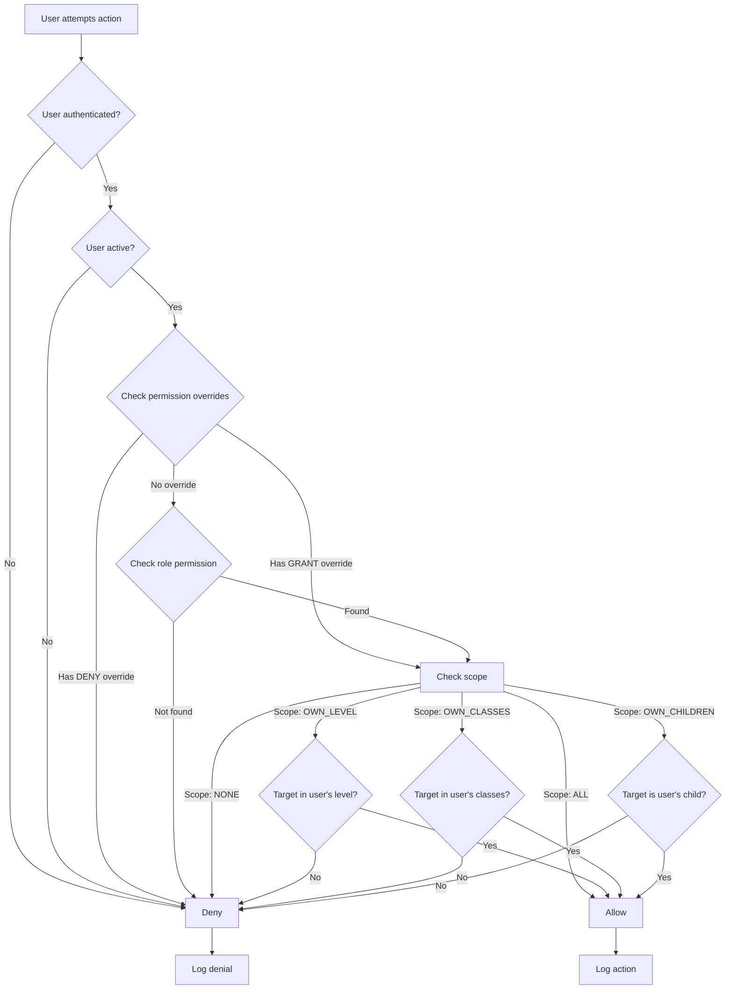

# Staff Roles & Permissions System - Product Documentation

**Version**: 1.0
**Date**: January 12, 2026
**System**: École Guinéenne - School Management System
**Author**: Product Design Team

---

## Table of Contents

1. [Executive Summary](#executive-summary)
2. [System Overview](#system-overview)
3. [Staff Roles](#staff-roles)
4. [Permission Model](#permission-model)
5. [Key Workflows](#key-workflows)
6. [Dashboard Designs](#dashboard-designs)
7. [Technical Architecture](#technical-architecture)
8. [Implementation Plan](#implementation-plan)
9. [Security & Compliance](#security--compliance)
10. [Glossary](#glossary)

---

## Executive Summary

### What We're Building

A comprehensive **Role-Based Access Control (RBAC)** system for a school management platform that serves a K-12 private school in Guinea. The system will manage 13 distinct staff roles, each with tailored permissions and custom dashboards.

### Why It Matters

**Current Problem:**
- No proper access control - everyone can see/edit everything
- Security risk - financial data exposed to all users
- Workflow inefficiency - staff don't have focused tools for their jobs
- Audit challenges - can't track who did what

**Our Solution:**
- **13 role-based user types** with granular permissions
- **Custom dashboards** for each role showing only relevant information
- **Separation of duties** for financial transactions (security best practice)
- **Audit trail** of all permission-checked actions

### Key Benefits

| Stakeholder | Benefit |
|------------|---------|
| **School Owner** | Real-time financial oversight without operational burden |
| **Principals** | Focused academic management for their school level |
| **Accountant** | Complete control over finances with proper safeguards |
| **Teachers** | Simple interface showing only their classes |
| **IT Admin** | Centralized user management with override capabilities |

### Success Metrics

- ✅ **100% role coverage** - Every staff member fits into a defined role
- ✅ **Zero unauthorized access** - No staff can access data outside their scope
- ✅ **<200ms permission checks** - System remains fast with security
- ✅ **Clear audit trail** - Every sensitive action is logged with user ID

---

## System Overview

### The School Structure

```
École Guinéenne (Private K-12 School)
│
├── MATERNELLE (Kindergarten)
│   ├── Petite Section (PS)
│   ├── Moyenne Section (MS)
│   └── Grande Section (GS)
│
├── PRIMAIRE (Primary School)
│   ├── CP1, CP2 (Grade 1-2)
│   ├── CE1, CE2 (Grade 3-4)
│   └── CM1, CM2 (Grade 5-6)
│
└── SECONDAIRE (Secondary School)
    ├── COLLÈGE (Middle School)
    │   └── 6ème, 5ème, 4ème, 3ème
    └── LYCÉE (High School)
        └── 2nde, 1ère, Terminale
```

### Administrative Structure

```
Ownership Layer
└── Propriétaire (Owner/Founder)
    └── Administrateur Système (IT Admin)

Operations Layer
├── Coordinateur Général (General Operations Coordinator)
│   ├── Finance Team
│   │   ├── Comptable (Accountant)
│   │   └── Agent de Recouvrement (Collections Agent)
│   │
│   ├── Secondary School (Collège & Lycée)
│   │   ├── Proviseur (Principal)
│   │   ├── Censeur (Vice Principal)
│   │   └── Surveillant Général (Dean of Students)
│   │
│   └── Primary School (Primaire & Maternelle)
│       ├── Directeur (Director)
│       └── Secrétariat (Secretary)
│
└── Teaching Staff
    ├── Enseignant (Teacher)
    └── Professeur Principal (Homeroom Teacher)
```

### Core Modules

The system has 10 major functional modules:

1. **Student Management** - Enrollment, profiles, transfers
2. **Academic Management** - Classes, subjects, schedules
3. **Grades & Report Cards** - Grade entry, report generation
4. **Attendance** - Daily tracking, absence justification
5. **Fee Management** - Fee structure, student balances
6. **Cash & Treasury** - Safe management, transactions
7. **Staff Management** - Staff profiles, assignments
8. **Discipline** - Incident tracking, sanctions
9. **Communication** - SMS, announcements
10. **Reports & Analytics** - Financial, academic, operational reports

Each module has specific **resources** that can be acted upon with different **permissions**.

---

## Staff Roles

We have 13 distinct roles, organized by functional area:

### 1. Secondary School Administration

#### PROVISEUR (Principal - Collège & Lycée)

**French Title**: Proviseur
**English**: Principal / Headmaster
**Reports To**: Coordinateur Général
**Manages**: Censeur, Surveillant Général, Secondary Teachers

**Responsibilities:**
- Overall leadership of secondary school (Collège & Lycée)
- Academic quality and teacher performance
- Final approval of report cards for secondary students
- Discipline oversight (serious cases)
- Parent relations for secondary families

**Key Permissions:**
- ✅ Full access to secondary school students, classes, grades
- ✅ Can approve report cards and grade changes
- ✅ Can assign teachers to secondary classes
- ❌ Cannot access Primaire/Maternelle data
- ❌ Cannot access financial/safe management

**Daily Tasks:**
- Review attendance reports
- Approve finalized report cards
- Handle escalated disciplinary cases
- Meet with teachers and parents
- Monitor academic performance metrics

**Dashboard Highlights:**
- Total secondary students
- Today's attendance rate
- Pending report card approvals
- Recent disciplinary incidents
- Class performance summaries

---

#### CENSEUR (Vice Principal - Collège & Lycée)

**French Title**: Censeur
**English**: Vice Principal / Deputy Head
**Reports To**: Proviseur
**Manages**: Teacher schedules and coordination

**Responsibilities:**
- Academic oversight and teacher coordination
- Class schedule management
- Grade entry monitoring (ensuring teachers complete grades on time)
- Substitute teacher coordination
- Steps in when Proviseur is absent

**Key Permissions:**
- ✅ View and edit secondary school grades
- ✅ View all secondary classes and students
- ✅ Assign teachers to classes
- ⚠️ Can approve report cards (with Proviseur oversight)
- ❌ Cannot delete students or classes

**Daily Tasks:**
- Monitor grade entry completion by teachers
- Coordinate teacher schedules
- Review attendance issues
- Communicate with teachers about student progress

**Dashboard Highlights:**
- Teachers present today
- Pending grade entries (by teacher)
- Class schedules
- Student attendance overview

---

#### SURVEILLANT GÉNÉRAL (Dean of Students)

**French Title**: Surveillant Général
**English**: Dean of Students / Head of Discipline
**Reports To**: Proviseur
**Manages**: Student behavior and attendance

**Responsibilities:**
- Student discipline and behavior management
- Attendance monitoring and follow-up
- Student welfare and safety
- Handle student conflicts
- Communicate with parents about behavior issues

**Key Permissions:**
- ✅ Full access to discipline records
- ✅ Can create incidents and assign sanctions
- ✅ View and mark attendance (all secondary students)
- ✅ Can send SMS to parents
- 👁️ View grades (read-only)
- ❌ Cannot edit academic records

**Daily Tasks:**
- Review daily attendance
- Handle disciplinary incidents
- Meet with students who have behavior issues
- Contact parents about absences or behavior
- Monitor students at risk

**Dashboard Highlights:**
- Absent students today
- Late arrivals
- Active disciplinary cases
- Students with frequent absences
- Recent incidents list

---

### 2. Primary School Administration

#### DIRECTEUR (Director - Primaire & Maternelle)

**French Title**: Directeur / Directrice
**English**: Director / Principal
**Reports To**: Coordinateur Général
**Manages**: Secrétariat, Primary Teachers

**Responsibilities:**
- Overall leadership of primary school and kindergarten
- Academic quality for young learners
- Parent relations for primary families
- Enrollment approvals for Primaire/Maternelle
- Teacher assignments and evaluations

**Key Permissions:**
- ✅ Full access to Primaire & Maternelle students, classes, grades
- ✅ Can approve enrollments for primary students
- ✅ Can approve report cards
- ✅ Can adjust fees (special cases with Comptable approval)
- ❌ Cannot access Secondaire data
- ❌ Cannot access safe management

**Daily Tasks:**
- Review attendance for primary/kindergarten
- Handle parent inquiries and meetings
- Approve new enrollments
- Monitor teacher performance
- Review grade distributions

**Dashboard Highlights:**
- Total primary students
- Attendance rate (by grade level)
- Pending enrollments to review
- Fee collection rate for primary
- Class capacity status

---

#### SECRÉTARIAT (Secretary / Administrative Assistant)

**French Title**: Secrétariat
**English**: Secretary / Administrative Assistant
**Reports To**: Directeur
**Supports**: All primary school operations

**Responsibilities:**
- Process enrollment applications
- Maintain student records and files
- Prepare documents (certificates, transcripts)
- Schedule parent meetings
- Handle front office duties
- Send routine SMS to parents

**Key Permissions:**
- ✅ Can create and edit student records (Primaire/Maternelle)
- ✅ Can process enrollments (submit for Directeur approval)
- ✅ Can view student balances and send payment reminders
- ✅ Can record payment intents (when parents pay at office)
- ✅ Can send SMS to parents
- 👁️ View grades (read-only)
- ❌ Cannot approve enrollments (requires Directeur)
- ❌ Cannot access safe or financial reports

**Daily Tasks:**
- Process new enrollment forms
- Print student documents (certificates, receipts)
- Answer parent phone calls and emails
- Schedule appointments
- Update student contact information

**Dashboard Highlights:**
- Pending enrollments to process
- Documents to print today
- Recent parent contacts
- SMS messages to send
- Today's appointments

---

### 3. Finance Team

#### COMPTABLE (Accountant)

**French Title**: Comptable
**English**: Accountant / Bursar
**Reports To**: Coordinateur Général (operationally), Propriétaire (financially)
**Manages**: School finances, safe (caisse), bank accounts

**Responsibilities:**
- **Primary responsibility: Manage the school's safe (caisse)**
- Record all income (tuition payments, registration fees)
- Record all expenses (supplies, salaries, utilities)
- Perform daily safe verification (count cash, reconcile)
- Bank transfers (safe → bank, bank → safe)
- Generate financial reports
- Monitor safe thresholds (alert when cash too high/low)
- Confirm payment intents from Agent de Recouvrement

**Key Permissions:**
- ✅ Full access to safe management (view balance, record transactions)
- ✅ Can confirm payment intents and link to students
- ✅ Can view student balances (all students)
- ✅ Can assign fees and apply discounts (with approval)
- ✅ Can generate and export financial reports
- ⚠️ Bank transfers require threshold limits or approval
- 👁️ View student lists (to link payments)
- ❌ Cannot edit academic records
- ❌ Cannot manage user accounts

**Daily Tasks:**
- Count safe cash (morning verification)
- Confirm payment intents from Agent de Recouvrement
- Record expenses as they occur
- Transfer excess cash to bank
- Review daily income/expense summary
- Generate financial reports for owner

**Dashboard Highlights:**
- **Safe balance (large, prominent display)**
- Today's income
- Today's expenses
- Bank balance
- Recent transactions list
- Pending payment confirmations
- Safe threshold alerts

**Special Note:**
The Comptable is the **only person** who can physically touch the safe and record safe transactions. This creates proper separation of duties and prevents fraud.

---

#### AGENT DE RECOUVREMENT (Collections Agent)

**French Title**: Agent de Recouvrement
**English**: Collections Agent / Fee Collector
**Reports To**: Comptable
**Works With**: Parents, Comptable

**Responsibilities:**
- Track students with outstanding balances
- Contact parents about overdue payments
- Collect payments from parents (in person or via mobile money)
- Create payment intents (record that payment was received)
- Hand cash to Comptable for safe deposit
- Follow up on payment plans
- Send payment reminder SMS

**Key Permissions:**
- ✅ View student balances (all students)
- ✅ Can create payment intents (but NOT confirm them)
- ✅ Can issue temporary receipts
- ✅ Can send SMS to parents about fees
- 👁️ View payment history
- 👁️ View basic student info (to contact parents)
- ❌ Cannot access safe or financial reports
- ❌ Cannot confirm payments (requires Comptable)
- ❌ Cannot modify fee structures

**Daily Tasks:**
- Review list of students with outstanding balances
- Call/SMS parents with overdue fees
- Meet parents who come to pay
- Collect cash/mobile money payments
- Create payment intents in system
- Hand cash to Comptable
- Generate collection reports

**Dashboard Highlights:**
- Total outstanding fees
- Amount collected today
- Students with balances (sorted by amount)
- Overdue payments
- Recent payments recorded
- Collection rate by grade

**Workflow with Comptable:**
```
1. Agent collects 500,000 GNF from parent
2. Agent creates "Payment Intent" in system
3. Agent prints temporary receipt for parent
4. Agent physically hands cash to Comptable
5. Comptable verifies cash amount
6. Comptable confirms payment intent → creates Payment record
7. Comptable deposits cash to safe → creates Safe Transaction
8. System updates student balance
9. Official receipt available for download
```

---

#### COORDINATEUR GÉNÉRAL DES OPÉRATIONS (General Operations Coordinator)

**French Title**: Coordinateur Général des Opérations
**English**: General Operations Coordinator / COO
**Reports To**: Propriétaire
**Manages**: Cross-departmental operations

**Responsibilities:**
- High-level operational oversight across all departments
- Monitor KPIs (academic, financial, operational)
- Coordinate between Proviseur, Directeur, Comptable
- Ensure smooth day-to-day operations
- Handle escalated issues
- Strategic planning and implementation

**Key Permissions:**
- ✅ View access to ALL modules (academic, financial, operational)
- ✅ Can view safe balance and financial reports
- ✅ Can view all students, grades, attendance (all levels)
- ⚠️ Can approve major expenses (above Comptable threshold)
- ⚠️ Can approve bank transfers (oversight role)
- ❌ Cannot directly record safe transactions (Comptable's job)
- ❌ Cannot manage user accounts (Admin Système's job)

**Daily Tasks:**
- Review operational dashboards
- Monitor financial health (safe balance, collection rate)
- Check academic metrics (attendance, performance)
- Address escalated issues from staff
- Coordinate department meetings

**Dashboard Highlights:**
- School-wide student count
- Overall attendance rate
- Safe balance
- Fee collection rate
- Revenue vs. expenses (monthly)
- Critical alerts from all departments

---

### 4. Teaching Staff

#### ENSEIGNANT (Teacher)

**French Title**: Enseignant / Professeur
**English**: Teacher
**Reports To**: Proviseur (secondary) or Directeur (primary)
**Teaches**: One or more subjects to assigned classes

**Responsibilities:**
- Teach assigned classes
- Enter grades for their students
- Mark attendance for their classes
- Communicate with parents about student progress
- Participate in faculty meetings

**Key Permissions:**
- 🔒 Can ONLY access their own assigned classes
- ✅ Can view student lists (own classes only)
- ✅ Can enter and edit grades (own classes/subjects only)
- ✅ Can mark attendance (own classes only)
- ✅ Can send SMS to parents (own students only)
- 👁️ Can view grade distribution for own classes
- ❌ Cannot access other teachers' classes
- ❌ Cannot access financial information
- ❌ Cannot edit student profiles

**Daily Tasks:**
- Mark attendance for classes taught today
- Enter grades for assignments/exams
- Review student performance in own classes
- Respond to parent inquiries
- Prepare lesson plans

**Dashboard Highlights:**
- My classes (with student counts)
- Pending grade entries
- Attendance to mark (today)
- Today's schedule
- Recent messages from parents

---

#### PROFESSEUR PRINCIPAL (Homeroom Teacher)

**French Title**: Professeur Principal
**English**: Homeroom Teacher / Class Teacher
**Reports To**: Proviseur or Directeur
**Manages**: One homeroom class + teaches subjects

**Responsibilities:**
- All regular teacher duties PLUS:
- Overall responsibility for one homeroom class
- Finalize report cards for homeroom students
- Coordinate parent-teacher meetings
- Monitor overall academic progress of homeroom students
- Act as main point of contact for homeroom parents

**Key Permissions:**
- 🔒 Same as Enseignant for teaching assignments
- ✅ PLUS: Can view ALL grades for homeroom students (across subjects)
- ✅ Can generate report cards for homeroom class
- ✅ Can send communications to all homeroom parents
- 👁️ Can view attendance history for homeroom students
- ❌ Cannot approve report cards (requires Proviseur/Directeur)

**Daily Tasks:**
- Regular teaching duties
- Monitor homeroom class attendance and grades
- Review progress of at-risk students
- Prepare for parent meetings
- Finalize report card comments

**Dashboard Highlights:**
- My homeroom class summary
- Pending grade entries (all my classes)
- Report cards to finalize
- Homeroom attendance overview
- Students at risk (homeroom)
- Upcoming parent meetings

---

### 5. Leadership & Administration

#### PROPRIÉTAIRE (Owner / Founder)

**French Title**: Propriétaire / Fondateur
**English**: Owner / Founder
**Reports To**: N/A (school owner)
**Oversees**: Everything (strategic level)

**Responsibilities:**
- Strategic direction and major decisions
- Financial oversight and profitability
- Monitor school performance (KPIs)
- Approve major expenditures
- Hire/fire senior staff
- **Does NOT handle day-to-day operations**

**Key Permissions:**
- 👁️ **VIEW ONLY** for almost everything
- 👁️ Can view safe balance and all financial reports
- 👁️ Can view student counts, attendance, academic reports
- ⚠️ Can approve major bank transfers (high amounts)
- ⚠️ Can set safe thresholds
- ❌ Cannot record transactions (operations are delegated)
- ❌ Cannot edit grades or student records
- ❌ Cannot manage user accounts

**Daily Tasks:**
- Check safe balance (first thing in morning)
- Review financial reports (daily/weekly)
- Monitor key metrics dashboard
- Approve major expenses
- Strategic planning

**Dashboard Highlights:**
- **Safe balance (very prominent)**
- Monthly revenue
- Monthly expenses
- Net income
- Total students (all levels)
- Fee collection rate
- Revenue trends (6-month chart)
- Critical alerts

**Philosophy:**
The owner should be able to check the financial health of the school at any time WITHOUT needing to be involved in recording every transaction. This is **oversight, not micromanagement**.

---

#### ADMINISTRATEUR SYSTÈME (System Administrator)

**French Title**: Administrateur Système
**English**: System Administrator / IT Admin
**Reports To**: Propriétaire or Coordinateur Général
**Manages**: All user accounts, system settings, technical issues

**Responsibilities:**
- Create and manage user accounts
- Assign roles to users
- Reset passwords
- Configure system settings
- Troubleshoot technical issues
- Monitor system health and logs
- Data backup and security
- Permission overrides (when needed)

**Key Permissions:**
- ✅ **FULL ACCESS** to everything (for troubleshooting)
- ✅ Can create/edit/delete user accounts
- ✅ Can assign and change user roles
- ✅ Can grant permission overrides
- ✅ Can access system logs and activity
- ✅ Can configure school settings
- ✅ Can export all data
- ⚠️ Should NOT use access for daily operations
- ⚠️ All actions are logged for audit

**Daily Tasks:**
- Monitor system health
- Create accounts for new staff
- Reset passwords for locked accounts
- Review failed login attempts
- Respond to technical support requests

**Dashboard Highlights:**
- Active user accounts
- Failed logins today
- System uptime
- Recent user activity
- Pending account requests
- User accounts by role

**Important Note:**
The Admin Système has full access for **technical support**, not for operational use. They should not be entering grades, recording payments, etc. unless troubleshooting an issue.

---

### 6. Support Staff

#### GARDIEN DE JOUR / GARDIEN DE NUIT (Security Guards)

**French Title**: Gardien de Jour / Gardien de Nuit
**English**: Day Guard / Night Guard
**Reports To**: Coordinateur Général
**Manages**: School security and premises

**Responsibilities:**
- Control entry/exit of students, staff, visitors
- Monitor school premises
- Report security incidents
- Maintain visitor log

**Key Permissions:**
- 👁️ View student list (to verify student identity)
- 👁️ View staff list
- ❌ No access to academic records
- ❌ No access to financial data
- ❌ No edit permissions

**Note:** These roles have minimal system access. Most of their work is physical security. System access is mainly for student/staff verification at gates.

---

### 7. Parent Portal

#### PARENT

**French Title**: Parent
**English**: Parent
**Access**: Parent portal (separate from staff system)

**Responsibilities:**
- View their children's information
- Monitor academic progress
- Check attendance
- View and pay fees
- Communicate with teachers

**Key Permissions:**
- 🔒 Can ONLY access own children's data
- 👁️ View children's grades and report cards
- 👁️ View attendance history
- 👁️ View fee balance and payment history
- ✅ Can make online payments (if enabled)
- ❌ Cannot see other students
- ❌ Cannot edit any data

**Dashboard Highlights:**
- My children (cards with photos)
- Total balance across all children
- Recent attendance
- Recent grades
- Upcoming report cards
- Messages from teachers

---

## Permission Model

### Core Concepts

#### 1. Resources

A **resource** is something in the system that can be accessed or modified. Examples:

- `STUDENTS` - Student records
- `CLASSES` - Class lists and assignments
- `GRADES` - Student grades and marks
- `SAFE_BALANCE` - Safe balance and transactions
- `FINANCIAL_REPORTS` - Financial reports and analytics

**Full list of resources:**
```
STUDENTS
STUDENT_ENROLLMENT
STUDENT_TRANSFER
CLASSES
SUBJECTS
ACADEMIC_YEAR
TEACHERS_ASSIGNMENT
GRADES
REPORT_CARDS
ATTENDANCE
ATTENDANCE_JUSTIFICATION
FEE_STRUCTURE
FEE_ASSIGNMENT
STUDENT_BALANCE
PAYMENT_RECORDING
RECEIPTS
SAFE_BALANCE
SAFE_INCOME
SAFE_EXPENSE
BANK_TRANSFERS
DAILY_VERIFICATION
FINANCIAL_REPORTS
STAFF
USER_ACCOUNTS
ROLE_ASSIGNMENT
DISCIPLINE_RECORDS
SANCTIONS
SMS
ANNOUNCEMENTS
ACADEMIC_REPORTS
ATTENDANCE_REPORTS
DATA_EXPORT
SCHOOL_SETTINGS
SYSTEM_SETTINGS
```

#### 2. Actions

An **action** is what you want to do with a resource. We use 6 standard actions:

| Action | Description | Example |
|--------|-------------|---------|
| `VIEW` | Read-only access | View student list |
| `CREATE` | Create new records | Add new student |
| `UPDATE` | Edit existing records | Update student phone |
| `DELETE` | Delete/archive records | Archive old student |
| `APPROVE` | Review and approve | Approve report card |
| `EXPORT` | Export data | Download financial report |

#### 3. Scope

**Scope** defines WHICH records a user can access. This is what makes the system powerful.

| Scope | Description | Example |
|-------|-------------|---------|
| `ALL` | All records in system | Proviseur sees all Secondaire students |
| `OWN_LEVEL` | Only records from user's school level | Directeur sees only Primaire students |
| `OWN_CLASSES` | Only records from user's assigned classes | Teacher sees only their students |
| `OWN_CHILDREN` | Only user's own children | Parent sees only their kids |
| `NONE` | No access | Teachers cannot access safe |

#### 4. Permission Formula

```
Permission = Role + Resource + Action + Scope
```

**Examples:**

```typescript
// Proviseur can VIEW all STUDENTS in Secondaire
{
  role: "PROVISEUR",
  resource: "STUDENTS",
  action: "VIEW",
  scope: "OWN_LEVEL"  // OWN_LEVEL = Secondaire for Proviseur
}

// Teacher can UPDATE GRADES for own classes only
{
  role: "ENSEIGNANT",
  resource: "GRADES",
  action: "UPDATE",
  scope: "OWN_CLASSES"  // Only classes assigned to this teacher
}

// Comptable can VIEW SAFE_BALANCE for entire school
{
  role: "COMPTABLE",
  resource: "SAFE_BALANCE",
  action: "VIEW",
  scope: "ALL"  // All safe transactions
}

// Parent can VIEW GRADES for own children only
{
  role: "PARENT",
  resource: "GRADES",
  action: "VIEW",
  scope: "OWN_CHILDREN"  // Only their kids
}
```

### Permission Resolution Flow



### Permission Checking Examples

#### Example 1: Teacher Viewing Student

**Scenario:** Teacher "Amadou" wants to view student "Fatoumata" in class "6ème A"

```typescript
// Permission check
const canView = await hasPermission({
  userId: "amadou-123",
  resource: "STUDENTS",
  action: "VIEW",
  targetId: "fatoumata-456"
})

// System checks:
// 1. Amadou's role: ENSEIGNANT
// 2. Default permission for ENSEIGNANT + STUDENTS + VIEW = OWN_CLASSES
// 3. Check scope: Is Fatoumata in Amadou's assigned classes?
//    - Query: Does Amadou teach "6ème A"? YES
//    - Result: ALLOW
```

#### Example 2: Proviseur Viewing Primary Student

**Scenario:** Proviseur tries to view a student in "CP1" (primary school)

```typescript
const canView = await hasPermission({
  userId: "proviseur-789",
  resource: "STUDENTS",
  action: "VIEW",
  targetId: "student-cp1-123"
})

// System checks:
// 1. Proviseur's role: PROVISEUR
// 2. Default permission for PROVISEUR + STUDENTS + VIEW = OWN_LEVEL
// 3. Check scope: Is CP1 student in Secondaire level?
//    - Query: Student's level = PRIMAIRE
//    - Proviseur's level = SECONDAIRE
//    - Result: DENY (different school level)
```

#### Example 3: Permission Override

**Scenario:** Proviseur needs temporary access to a Primaire student (special case)

```typescript
// Admin Système creates permission override
await prisma.permissionOverride.create({
  data: {
    userId: "proviseur-789",
    resource: "STUDENTS",
    action: "VIEW",
    scope: "ALL",  // Override to ALL instead of OWN_LEVEL
    granted: true,
    reason: "Handling student transfer from Primaire to Collège"
  }
})

// Now the permission check will:
// 1. Find override first
// 2. Override has GRANT + scope ALL
// 3. Result: ALLOW (even though it's a primary student)
```

---

## Key Workflows

### Workflow 1: Fee Collection (Two-Step Process)

**Why two steps?**
Separation of duties. The person collecting money should NOT be the same person managing the safe. This prevents fraud.

**Participants:**
- Parent (paying)
- Agent de Recouvrement (collecting)
- Comptable (confirming and depositing)

**Step-by-Step:**

```
┌─────────────────────────────────────────────────────────┐
│ STEP 1: Payment Collection (Agent de Recouvrement)     │
└─────────────────────────────────────────────────────────┘

1. Parent visits school to pay 500,000 GNF

2. Agent de Recouvrement:
   - Searches for student in system
   - Views student balance: 2,000,000 GNF remaining
   - Clicks "Record Payment"

3. Payment Intent Form:
   ┌─────────────────────────────────────────┐
   │ Student: Mamadou Diallo (ST-2024-0123) │
   │ Current Balance: 2,000,000 GNF          │
   │                                         │
   │ Payment Amount: 500,000 GNF             │
   │ Payment Method: ○ Cash ○ Orange Money   │
   │ Receipt Number: RCP-2026-0456 (auto)   │
   │                                         │
   │ Payer Information:                      │
   │ Name: Ibrahima Diallo (Father)         │
   │ Phone: +224 621 12 34 56               │
   │                                         │
   │ Notes: [Payment for Schedule 2]         │
   │                                         │
   │ [Create Payment Intent]                 │
   └─────────────────────────────────────────┘

4. System creates PaymentIntent record:
   - Status: PENDING_CONFIRMATION
   - Amount: 500,000 GNF
   - Collected by: Agent's user ID
   - Collected at: 2026-01-12 10:30 AM

5. Agent prints TEMPORARY RECEIPT for parent:
   ┌─────────────────────────────────────────┐
   │        ÉCOLE GUINÉENNE                  │
   │     REÇU TEMPORAIRE                     │
   │                                         │
   │ Numéro: RCP-2026-0456                   │
   │ Date: 12 janvier 2026, 10:30           │
   │                                         │
   │ Reçu de: Ibrahima Diallo                │
   │ Pour: Mamadou Diallo (ST-2024-0123)    │
   │ Montant: 500,000 GNF                    │
   │ Méthode: Espèces                        │
   │                                         │
   │ Collecté par: Aissatou (Agent)         │
   │                                         │
   │ ⚠️ Ce reçu sera confirmé par le         │
   │    service comptabilité                 │
   └─────────────────────────────────────────┘

6. Agent physically hands 500,000 GNF cash to Comptable


┌─────────────────────────────────────────────────────────┐
│ STEP 2: Payment Confirmation (Comptable)               │
└─────────────────────────────────────────────────────────┘

7. Comptable sees "Pending Payment Intent" notification

8. Comptable opens pending intents list:
   ┌──────────────────────────────────────────────────────┐
   │ PAIEMENTS EN ATTENTE DE CONFIRMATION                 │
   │                                                      │
   │ ┌──────────────────────────────────────────────┐   │
   │ │ RCP-2026-0456                                │   │
   │ │ Mamadou Diallo (ST-2024-0123)               │   │
   │ │ Montant: 500,000 GNF                         │   │
   │ │ Collecté par: Aissatou à 10:30              │   │
   │ │ Père: Ibrahima Diallo                       │   │
   │ │                                              │   │
   │ │ [Confirmer et déposer]  [Rejeter]          │   │
   │ └──────────────────────────────────────────────┘   │
   └──────────────────────────────────────────────────────┘

9. Comptable:
   - Verifies cash amount matches (500,000 GNF)
   - Clicks "Confirmer et déposer"

10. System executes transaction (atomic):
    - Creates Payment record (links to student enrollment)
    - Creates SafeTransaction record (income to safe)
    - Updates PaymentIntent status to CONFIRMED
    - Updates student balance: 2,000,000 - 500,000 = 1,500,000 GNF
    - Updates safe balance: +500,000 GNF

11. System generates OFFICIAL RECEIPT (available for download)

12. Parent can now download official receipt from parent portal
```

**Benefits:**
- ✅ **Fraud prevention** - Agent cannot pocket money without Comptable knowing
- ✅ **Clear audit trail** - Every payment has collector + confirmer
- ✅ **Reconciliation** - Pending intents show "cash in transit"
- ✅ **Parent satisfaction** - Immediate temporary receipt
- ✅ **Accountability** - If money goes missing, we know who handled it

**Data Flow:**

```
PaymentIntent (created by Agent)
      ↓
Cash handed to Comptable
      ↓
Comptable confirms
      ↓
   ┌──────────────────┐
   │                  │
   ↓                  ↓
Payment         SafeTransaction
(student record)  (safe record)
```

---

### Workflow 2: Grade Entry & Approval

**Participants:**
- Enseignant (Teacher)
- Professeur Principal (Homeroom Teacher)
- Proviseur/Directeur (Principal)

**Step-by-Step:**

```
┌─────────────────────────────────────────────────────────┐
│ PHASE 1: Grade Entry (Teachers)                        │
└─────────────────────────────────────────────────────────┘

Week 1-8: Regular grade entry throughout term

Teacher logs in → Sees "My Classes"
  → Selects "6ème A - Mathématiques"
  → Clicks "Enter Grades"

Grade Entry Screen:
┌──────────────────────────────────────────────────────┐
│ 6ème A - Mathématiques                               │
│ Trimestre 1 - Devoir 1                              │
│                                                      │
│ Student               Grade    /20   Absent   Save  │
│ ────────────────────────────────────────────────────│
│ Diallo Mamadou       [ 15  ]  /20   [ ]      [✓]   │
│ Bah Fatoumata        [ 18  ]  /20   [ ]      [✓]   │
│ Camara Ibrahima      [     ]  /20   [x]      [✓]   │
│ Sow Aissatou         [ 12  ]  /20   [ ]      [✓]   │
│                                                      │
│ [Save All]  [Submit for Review]                     │
└──────────────────────────────────────────────────────┘

System checks permission:
- Resource: GRADES
- Action: CREATE
- Scope: OWN_CLASSES
- Result: ✅ Allow (6ème A is assigned to this teacher)


┌─────────────────────────────────────────────────────────┐
│ PHASE 2: Report Card Preparation (Professeur Principal)│
└─────────────────────────────────────────────────────────┘

Week 9: End of trimester

Professeur Principal logs in → Dashboard shows:
  "Report Cards to Finalize: 6ème A (35 students)"

Clicks "Finalize Report Cards" → Sees table:
┌──────────────────────────────────────────────────────┐
│ 6ème A - Bulletin Trimestre 1                        │
│                                                      │
│ Student           Avg   Missing Grades   Action     │
│ ────────────────────────────────────────────────────│
│ Diallo Mamadou    14.5  ✓ Complete      [Generate] │
│ Bah Fatoumata     16.2  ✓ Complete      [Generate] │
│ Camara Ibrahima   13.1  ⚠️ EPS missing   [Review]   │
│ Sow Aissatou      15.8  ✓ Complete      [Generate] │
│                                                      │
│ Status: 3 ready, 1 incomplete                       │
│                                                      │
│ [Send Reminder to EPS Teacher]                      │
└──────────────────────────────────────────────────────┘

Once all grades complete:
  → Professeur Principal adds comments to each report card
  → Clicks "Submit for Approval"
  → Status changes to: PENDING_APPROVAL


┌─────────────────────────────────────────────────────────┐
│ PHASE 3: Approval (Proviseur/Directeur)                │
└─────────────────────────────────────────────────────────┘

Proviseur logs in → Dashboard shows:
  "Pending Approvals: 5 report cards"

Clicks "Review Report Cards" → Sees list by class:
┌──────────────────────────────────────────────────────┐
│ BULLETINS EN ATTENTE D'APPROBATION                   │
│                                                      │
│ 6ème A (Mme Diallo)         35 students  [Review]  │
│ 5ème B (M. Camara)          32 students  [Review]  │
│ 4ème A (M. Bah)             30 students  [Review]  │
│                                                      │
└──────────────────────────────────────────────────────┘

Clicks [Review] → Sees sample report cards
  → Can spot-check grades and comments
  → Reviews any outliers (very high/low grades)
  → Clicks "Approve All" or "Approve Selected"

Status changes to: APPROVED
  → Parents can now view on parent portal
  → Report cards can be printed
```

**Permission Checks at Each Phase:**

| Phase | User | Resource | Action | Scope | Result |
|-------|------|----------|--------|-------|--------|
| 1 | Enseignant | GRADES | CREATE | OWN_CLASSES | ✅ Only their classes |
| 2 | Prof Principal | GRADES | VIEW | OWN_CLASSES + Homeroom | ✅ All subjects for homeroom |
| 2 | Prof Principal | REPORT_CARDS | CREATE | Homeroom class | ✅ Can generate |
| 3 | Proviseur | REPORT_CARDS | APPROVE | OWN_LEVEL | ✅ All Secondaire |
| 3 | Directeur | REPORT_CARDS | APPROVE | OWN_LEVEL | ✅ All Primaire |

---

### Workflow 3: Owner's Daily Financial Check

**Scenario:** School owner calls every morning at 8 AM: "What's in the safe?"

**Step-by-Step:**

```
┌─────────────────────────────────────────────────────────┐
│ Morning Routine - Propriétaire                          │
└─────────────────────────────────────────────────────────┘

8:00 AM - Owner logs in from phone/tablet

Dashboard loads immediately (optimized for speed):

╔═══════════════════════════════════════════════════════╗
║            TABLEAU DE BORD PROPRIÉTAIRE               ║
╚═══════════════════════════════════════════════════════╝

┌───────────────────────────────────────────────────────┐
│                  TRÉSORERIE                           │
│                                                       │
│          💰 SOLDE CAISSE                             │
│                                                       │
│          45,750,000 GNF                              │
│                                                       │
│   ✓ Vérifié: Aujourd'hui à 07:30 par Fatoumata      │
│   ⚠️ Alerte: Approche du seuil maximum (50M)        │
│                                                       │
│   Recommandation: Transférer 20M à la banque        │
└───────────────────────────────────────────────────────┘

┌─────────────────┬─────────────────┬──────────────────┐
│  Revenus du mois│ Dépenses du mois│   Revenu net    │
│                 │                 │                  │
│  82,500,000 GNF │ 35,200,000 GNF │  47,300,000 GNF │
│  ↑ +12% vs déc  │ ↓ -5% vs déc   │  ↑ +18% vs déc  │
└─────────────────┴─────────────────┴──────────────────┘

┌───────────────────────────────────────────────────────┐
│              VUE D'ENSEMBLE ÉCOLE                     │
│                                                       │
│  👨‍🎓 Élèves: 847        📚 Taux présence: 94.2%      │
│  💵 Taux recouvrement: 78%    👨‍🏫 Personnel: 42      │
└───────────────────────────────────────────────────────┘

[Voir rapports financiers détaillés]
[Télécharger rapport mensuel]


Owner sees:
  ✅ Safe balance is healthy
  ⚠️ Getting close to maximum threshold
  ✅ Revenue is up vs last month
  ✅ Collection rate is on track

Owner can:
  👁️ View detailed financial reports
  👁️ View transaction history
  📊 Download monthly summary
  ⚠️ Approve major bank transfer (if Comptable requests)

Owner CANNOT:
  ❌ Record income/expenses (that's Comptable's job)
  ❌ Edit student records
  ❌ Modify grades
```

**What the owner sees vs. what the Comptable sees:**

| Information | Propriétaire | Comptable |
|------------|--------------|-----------|
| Safe balance | ✅ View | ✅ View + Record |
| Today's transactions | ✅ View summary | ✅ View detailed + Record |
| Monthly revenue | ✅ View | ✅ View + Generate reports |
| Bank balance | ✅ View | ✅ View + Transfer |
| Student balances | ✅ View totals | ✅ View individual + Edit |
| **Actions** | **View only** | **Full control** |

**The key principle:**
Owner has **oversight** without **operational burden**. They can check financial health anytime but don't need to be involved in every transaction.

---

### Workflow 4: User Account Creation

**Scenario:** New teacher "Mariama Diallo" is hired. She needs a system account.

**Step-by-Step:**

```
┌─────────────────────────────────────────────────────────┐
│ STEP 1: HR creates staff record (Proviseur/Directeur)  │
└─────────────────────────────────────────────────────────┘

Proviseur logs in → Staff Management
  → Click "Add New Staff"

Staff Form:
┌──────────────────────────────────────────────────────┐
│ Informations personnelles                            │
│ Prénom: Mariama                                      │
│ Nom: Diallo                                          │
│ Téléphone: +224 621 12 34 56                        │
│ Email: mariama.diallo@gmail.com                     │
│                                                      │
│ Poste: ○ Enseignant ○ Professeur Principal          │
│ Niveau: ○ Maternelle ○ Primaire ● Secondaire       │
│                                                      │
│ Date d'embauche: 15 janvier 2026                    │
│                                                      │
│ [Enregistrer]                                       │
└──────────────────────────────────────────────────────┘

System creates Staff record (ID: staff-456)


┌─────────────────────────────────────────────────────────┐
│ STEP 2: Assign classes (Proviseur/Censeur)             │
└─────────────────────────────────────────────────────────┘

Proviseur → Staff → Mariama Diallo → "Assign Classes"

Class Assignment:
┌──────────────────────────────────────────────────────┐
│ Mariama Diallo - Attribution des classes            │
│                                                      │
│ Année scolaire: 2025-2026                           │
│                                                      │
│ ☑️ 6ème A - Français                                │
│ ☑️ 6ème B - Français                                │
│ ☑️ 5ème A - Français (Professeur Principal)         │
│ ☐ 5ème B - Français                                 │
│                                                      │
│ [Enregistrer les attributions]                      │
└──────────────────────────────────────────────────────┘

System creates 3 TeacherClassAssignment records


┌─────────────────────────────────────────────────────────┐
│ STEP 3: Create user account (Admin Système)            │
└─────────────────────────────────────────────────────────┘

Admin Système receives notification:
  "New staff member needs account: Mariama Diallo"

Admin → User Accounts → "Create Account"

Account Creation:
┌──────────────────────────────────────────────────────┐
│ Créer compte utilisateur                             │
│                                                      │
│ Personnel: Mariama Diallo (staff-456)  [linked]    │
│                                                      │
│ Email: mariama.diallo@gmail.com                     │
│ (Will be used for login)                            │
│                                                      │
│ Rôle: ○ Enseignant ● Professeur Principal          │
│       (She's homeroom teacher for 5ème A)           │
│                                                      │
│ Mot de passe temporaire: [Auto-generate]           │
│   → TemP@2026!Xyz                                   │
│                                                      │
│ ☑️ Envoyer email avec instructions de connexion    │
│ ☑️ Obliger changement de mot de passe              │
│                                                      │
│ [Créer le compte]                                   │
└──────────────────────────────────────────────────────┘

System:
  1. Creates User record
  2. Links to Staff record (staffId)
  3. Assigns role: PROFESSEUR_PRINCIPAL
  4. Sends welcome email with temporary password
  5. Sets flag: mustChangePassword = true


┌─────────────────────────────────────────────────────────┐
│ STEP 4: First login (Mariama)                          │
└─────────────────────────────────────────────────────────┘

Mariama receives email:
  "Welcome to École Guinéenne System"
  Login: mariama.diallo@gmail.com
  Temporary password: TemP@2026!Xyz

Mariama visits system → Logs in
  → Immediately prompted: "Change your password"
  → Sets new secure password

Dashboard loads → Shows:
  ✅ My classes: 6ème A, 6ème B, 5ème A
  ✅ Homeroom class: 5ème A (highlighted)
  ✅ Can enter grades for all 3 classes
  ✅ Can view all grades for 5ème A students (homeroom)
  ❌ Cannot see other classes (permission check works!)
```

**Permission Check Example:**

```typescript
// Mariama tries to view grades for 4ème A (NOT her class)
GET /api/grades/4eme-a

→ System checks:
  - User: mariama.diallo@gmail.com
  - Role: PROFESSEUR_PRINCIPAL
  - Permission: GRADES + VIEW + OWN_CLASSES
  - Scope check: Is 4ème A in Mariama's assignments?
    Query: SELECT * FROM TeacherClassAssignment
           WHERE staffId = 'staff-456'
           AND classId = '4eme-a'
    Result: No rows found

  → Response: 403 Forbidden
  → UI: "You don't have permission to view this class"
```

---

## Dashboard Designs

### Design Principles

All dashboards follow these principles:

1. **Role-appropriate** - Only show what matters to this role
2. **Action-oriented** - Highlight tasks that need attention
3. **Fast-loading** - Critical info loads first
4. **Mobile-friendly** - Works on phone for checking on-the-go
5. **Color-coded** - Visual cues for status (green=good, red=urgent)

### Dashboard Components

We use these reusable widget types:

| Widget Type | Purpose | Example |
|------------|---------|---------|
| `stat_card` | Display single metric | "847 Students" |
| `safe_balance_card` | Show safe balance (prominent) | "45,750,000 GNF" |
| `pending_actions_list` | Tasks needing attention | "3 report cards to approve" |
| `recent_items_list` | Latest activity | "Recent payments" |
| `chart` | Trend visualization | "Revenue last 6 months" |
| `attendance_overview` | Attendance by class/grade | "94.2% present today" |
| `alert_banner` | Critical notifications | "Safe above threshold" |

### Sample Dashboard Layouts

#### Comptable Dashboard (Most Important)

```
╔═══════════════════════════════════════════════════════╗
║         TABLEAU DE BORD - COMPTABLE                   ║
╚═══════════════════════════════════════════════════════╝

┌───────────────────────────────────────────────────────┐
│              💰 SOLDE CAISSE                          │
│                                                       │
│              45,750,000 GNF                          │
│                                                       │
│   Dernière vérification: Aujourd'hui à 07:30         │
│   ⚠️ ALERTE: Approche seuil max (50M)                │
│                                                       │
│   [Effectuer vérification] [Transférer à banque]    │
└───────────────────────────────────────────────────────┘

┌──────────────┬──────────────┬──────────────┬─────────┐
│ Revenus      │ Dépenses     │ Solde        │ Banque  │
│ aujourd'hui  │ aujourd'hui  │ attendu      │         │
│              │              │              │         │
│ 2,500,000    │ 850,000      │ 47,400,000   │ 128M    │
│ ↑ 5 paiements│ ↓ 3 dépenses │              │         │
└──────────────┴──────────────┴──────────────┴─────────┘

┌───────────────────────────────────────────────────────┐
│           🔔 ACTIONS EN ATTENTE                       │
│                                                       │
│   ⚠️ 2 paiements à confirmer                          │
│   ⚠️ Vérification quotidienne non effectuée          │
│   ℹ️ 1 transfert bancaire demandé                     │
└───────────────────────────────────────────────────────┘

┌───────────────────────────────────────────────────────┐
│         TRANSACTIONS RÉCENTES                         │
│                                                       │
│ 10:30  +500,000   Paiement - Mamadou Diallo [✓]     │
│ 10:15  +300,000   Paiement - Aissatou Bah [✓]       │
│ 09:45  -120,000   Fournitures scolaires [✓]         │
│ 09:30  +750,000   Paiement - Ibrahima Sow [✓]       │
│ 09:00  -50,000    Eau et électricité [✓]            │
│                                                       │
│ [Voir toutes les transactions]                       │
└───────────────────────────────────────────────────────┘

┌───────────────────────────────────────────────────────┐
│    📊 STATISTIQUES FINANCIÈRES (Ce mois)             │
│                                                       │
│ [Bar chart: Revenue vs Expenses by week]             │
│                                                       │
│ Taux de recouvrement: 78%  (↑ +5% vs mois dernier)  │
└───────────────────────────────────────────────────────┘
```

**Key Features:**
- Safe balance is HUGE and prominent
- Alerts are visible (threshold warnings)
- Pending actions highlighted
- Recent transactions for quick verification
- Quick access to confirmation workflow

---

#### Proviseur Dashboard

```
╔═══════════════════════════════════════════════════════╗
║     TABLEAU DE BORD - PROVISEUR (SECONDAIRE)         ║
╚═══════════════════════════════════════════════════════╝

┌──────────────┬──────────────┬──────────────┬─────────┐
│ 👨‍🎓 Élèves    │ 📅 Présence  │ 👨‍🏫 Profs    │ ⚠️ Actions│
│              │              │              │         │
│     487      │    94.2%     │     28       │    7    │
│   Secondaire │  Aujourd'hui │   Présents   │Approb.  │
└──────────────┴──────────────┴──────────────┴─────────┘

┌───────────────────────────────────────────────────────┐
│           🔔 ACTIONS EN ATTENTE                       │
│                                                       │
│   📋 7 bulletins à approuver (Trimestre 1)            │
│   ⚠️ 3 cas disciplinaires à examiner                  │
│   📝 2 transferts d'élèves à valider                  │
│                                                       │
│   [Voir toutes les actions]                          │
└───────────────────────────────────────────────────────┘

┌───────────────────────────────────────────────────────┐
│       📊 PRÉSENCE AUJOURD'HUI (Par niveau)            │
│                                                       │
│   Collège:                                           │
│   6ème: ████████████░░  92.5% (148/160)             │
│   5ème: ██████████████  95.2% (139/146)             │
│   4ème: ███████████░░░  91.8% (123/134)             │
│   3ème: ███████████░░░  90.5% (105/116)             │
│                                                       │
│   Lycée:                                             │
│   2nde: █████████████░  93.8% (45/48)               │
│   1ère: ████████████░░  92.1% (35/38)               │
│   Term: ███████████████ 97.2% (35/36)               │
│                                                       │
│   [Voir absents] [Voir retards]                     │
└───────────────────────────────────────────────────────┘

┌───────────────────────────────────────────────────────┐
│       📈 STATISTIQUES ACADÉMIQUES                     │
│                                                       │
│   Moyenne générale: 13.2/20  (↑ +0.3 vs trim. passé) │
│   Taux de réussite: 87.5%                            │
│   Classes performantes: 3ème A (14.8), 2nde B (14.2)│
│   Classes à surveiller: 4ème C (11.5), 5ème B (11.8)│
│                                                       │
│   [Voir rapport détaillé]                            │
└───────────────────────────────────────────────────────┘
```

**Key Features:**
- Student count (Secondaire only - can't see Primaire)
- Academic-focused metrics
- Approval workflow highlighted
- Attendance overview by grade
- Performance analytics

---

#### Enseignant (Teacher) Dashboard

```
╔═══════════════════════════════════════════════════════╗
║       TABLEAU DE BORD - MARIAMA DIALLO                ║
╚═══════════════════════════════════════════════════════╝

┌───────────────────────────────────────────────────────┐
│              📚 MES CLASSES                           │
│                                                       │
│   ┌──────────────────────────────────────────────┐  │
│   │ 6ème A - Français                            │  │
│   │ 35 élèves  •  Prochain cours: Lun 14:00    │  │
│   │ ⚠️ 12 notes manquantes (Devoir 2)            │  │
│   │ [Entrer notes] [Voir présence]              │  │
│   └──────────────────────────────────────────────┘  │
│                                                       │
│   ┌──────────────────────────────────────────────┐  │
│   │ 6ème B - Français                            │  │
│   │ 32 élèves  •  Prochain cours: Mar 10:00    │  │
│   │ ✓ Toutes les notes à jour                   │  │
│   │ [Voir classe] [Voir présence]               │  │
│   └──────────────────────────────────────────────┘  │
│                                                       │
│   ┌──────────────────────────────────────────────┐  │
│   │ 5ème A - Français  ⭐ CLASSE PRINCIPALE      │  │
│   │ 30 élèves  •  Prochain cours: Mer 08:00    │  │
│   │ ⚠️ Bulletin à finaliser (28/30 complets)     │  │
│   │ [Finaliser bulletins] [Voir notes globales] │  │
│   └──────────────────────────────────────────────┘  │
└───────────────────────────────────────────────────────┘

┌──────────────┬──────────────┬──────────────┬─────────┐
│ Notes à      │ Présence à   │ Bulletins    │ Messages│
│ entrer       │ marquer      │ à finaliser  │parents  │
│              │              │              │         │
│     12       │      3       │      1       │    2    │
│    tâches    │   classes    │    classe    │ non lus │
└──────────────┴──────────────┴──────────────┴─────────┘

┌───────────────────────────────────────────────────────┐
│           📅 EMPLOI DU TEMPS AUJOURD'HUI              │
│                                                       │
│   08:00-09:00  5ème A  Français  [Marquer présence]  │
│   10:00-11:00  6ème B  Français  [Marquer présence]  │
│   14:00-15:00  6ème A  Français  [Marquer présence]  │
│                                                       │
│   [Voir semaine complète]                            │
└───────────────────────────────────────────────────────┘

┌───────────────────────────────────────────────────────┐
│       📊 PERFORMANCE DE MES ÉLÈVES                    │
│                                                       │
│   6ème A - Moyenne: 13.8/20                          │
│   6ème B - Moyenne: 14.2/20                          │
│   5ème A - Moyenne: 13.5/20 (Classe principale)      │
│                                                       │
│   Élèves à surveiller (classe principale):           │
│   - Camara Ibrahima (10.5) - Absences fréquentes    │
│   - Bah Aissatou (11.2) - Baisse récente           │
│                                                       │
│   [Voir détails] [Contacter parents]                 │
└───────────────────────────────────────────────────────┘
```

**Key Features:**
- Shows ONLY teacher's assigned classes
- Homeroom class highlighted
- Task-focused (grades to enter, attendance to mark)
- Today's schedule visible
- Quick access to common tasks
- Can only see/contact students in own classes

---

#### Agent de Recouvrement Dashboard

```
╔═══════════════════════════════════════════════════════╗
║     TABLEAU DE BORD - AGENT DE RECOUVREMENT          ║
╚═══════════════════════════════════════════════════════╝

┌──────────────┬──────────────┬──────────────┬─────────┐
│ 💰 Total     │ ✅ Collecté  │ 👨‍🎓 Élèves   │ ⏰ En    │
│ impayé       │ aujourd'hui  │ avec solde   │retard   │
│              │              │              │         │
│ 84,500,000   │ 2,500,000    │    247       │   89    │
│    GNF       │    GNF       │   étudiants  │ étudiants│
└──────────────┴──────────────┴──────────────┴─────────┘

┌───────────────────────────────────────────────────────┐
│        🎯 ÉLÈVES PRIORITAIRES À CONTACTER             │
│        (Solde > 1M ou retard > 30 jours)              │
│                                                       │
│ ┌──────────────────────────────────────────────────┐ │
│ │ Diallo Mamadou (6ème A) - ST-2024-0123          │ │
│ │ Solde: 2,000,000 GNF  •  Retard: 45 jours       │ │
│ │ 📞 +224 621 12 34 56 (Père: Ibrahima)           │ │
│ │ Dernier paiement: 15 nov 2025                   │ │
│ │ [Appeler] [SMS] [Enregistrer paiement]         │ │
│ └──────────────────────────────────────────────────┘ │
│                                                       │
│ ┌──────────────────────────────────────────────────┐ │
│ │ Bah Aissatou (CM2) - ST-2024-0456               │ │
│ │ Solde: 1,800,000 GNF  •  Retard: 38 jours       │ │
│ │ 📞 +224 622 23 45 67 (Mère: Fatoumata)          │ │
│ │ Dernier paiement: 20 nov 2025                   │ │
│ │ [Appeler] [SMS] [Enregistrer paiement]         │ │
│ └──────────────────────────────────────────────────┘ │
│                                                       │
│ [Voir tous (247 élèves)] [Filtrer par classe]       │
└───────────────────────────────────────────────────────┘

┌───────────────────────────────────────────────────────┐
│         💵 PAIEMENTS ENREGISTRÉS AUJOURD'HUI          │
│                                                       │
│ 10:30  Mamadou Diallo    500,000  RCP-2026-0456 ✓  │
│ 10:15  Aissatou Bah      300,000  RCP-2026-0457 ✓  │
│ 09:30  Ibrahima Sow      750,000  RCP-2026-0458 ⏳  │
│        (En attente confirmation comptable)            │
│                                                       │
│ Total collecté: 1,550,000 GNF                        │
│ En attente: 750,000 GNF                              │
│                                                       │
│ [Voir historique complet]                            │
└───────────────────────────────────────────────────────┘

┌───────────────────────────────────────────────────────┐
│       📊 STATISTIQUES DE RECOUVREMENT                 │
│                                                       │
│ [Bar chart: Collections by day this week]            │
│                                                       │
│ Taux de recouvrement: 78%                            │
│ Objectif mensuel: 90%  (Reste: 12%)                  │
│                                                       │
│ Par niveau:                                          │
│ Maternelle: 85% ████████▌  Primaire: 80% ████████   │
│ Collège: 75% ███████▌     Lycée: 72% ███████▏      │
│                                                       │
│ [Télécharger rapport]                                │
└───────────────────────────────────────────────────────┘
```

**Key Features:**
- Collection-focused metrics
- Prioritized list of students to contact
- Quick access to parent phone numbers
- Payment recording workflow prominent
- Today's collections tracked
- Can see payment status (pending confirmation)

---

## Technical Architecture

### Database Schema (Simplified)

```prisma
// Core user and role models
model User {
  id            String    @id @default(cuid())
  email         String    @unique
  name          String
  passwordHash  String

  // Role (single value - simpler than many-to-many)
  role          StaffRole
  isActive      Boolean   @default(true)

  // Links
  staffId       String?   @unique
  staff         Staff?

  // Permission overrides (for exceptions)
  permissionOverrides PermissionOverride[]

  createdAt     DateTime  @default(now())
  updatedAt     DateTime  @updatedAt
  lastLoginAt   DateTime?
}

// Staff member (teacher, admin, etc.)
model Staff {
  id              String      @id @default(cuid())
  firstName       String
  lastName        String
  phone           String
  email           String?     @unique

  position        StaffRole   // Their official position
  schoolLevel     SchoolLevel? // MATERNELLE, PRIMAIRE, SECONDAIRE

  // Teaching assignments (if teacher)
  classAssignments TeacherClassAssignment[]

  user            User?       // Link to user account

  isActive        Boolean     @default(true)
  hireDate        DateTime?

  createdAt       DateTime    @default(now())
  updatedAt       DateTime    @updatedAt
}

// Teacher-class assignments (for scope checking)
model TeacherClassAssignment {
  id          String   @id @default(cuid())
  staffId     String
  staff       Staff    @relation(fields: [staffId], references: [id])

  classId     String
  class       Class    @relation(fields: [classId], references: [id])

  subjectId   String?
  subject     Subject? @relation(fields: [subjectId], references: [id])

  isHomeroom  Boolean  @default(false)

  schoolYearId String
  schoolYear   SchoolYear @relation(fields: [schoolYearId], references: [id])

  createdAt   DateTime @default(now())
}

// Default permissions for each role
model RolePermission {
  id        String              @id @default(cuid())
  role      StaffRole           // PROVISEUR, COMPTABLE, etc.
  resource  PermissionResource  // STUDENTS, GRADES, SAFE_BALANCE, etc.
  action    PermissionAction    // VIEW, CREATE, UPDATE, DELETE, APPROVE
  scope     PermissionScope     // ALL, OWN_LEVEL, OWN_CLASSES, etc.

  createdAt DateTime            @default(now())
  updatedAt DateTime            @updatedAt

  @@unique([role, resource, action])
}

// Permission overrides for specific users
model PermissionOverride {
  id        String              @id @default(cuid())
  userId    String
  user      User                @relation(fields: [userId], references: [id])

  resource  PermissionResource
  action    PermissionAction
  scope     PermissionScope

  granted   Boolean             @default(true)  // true=GRANT, false=DENY
  reason    String?             // Why this override exists

  createdAt DateTime            @default(now())
  createdById String?

  @@unique([userId, resource, action])
}

// Payment Intent (for two-step payment recording)
model PaymentIntent {
  id            String    @id @default(cuid())
  studentId     String
  student       Student   @relation(fields: [studentId], references: [id])

  amount        Int
  method        PaymentMethod
  receiptNumber String    @unique

  // Collection info
  collectedBy   String
  collector     User      @relation("CollectedBy", fields: [collectedBy], references: [id])
  collectedAt   DateTime

  // Payer info
  payerName     String?
  payerPhone    String?
  payerType     String?   // father, mother, other

  // Status
  status        String    @default("pending_confirmation") // pending_confirmation, confirmed, rejected

  // Confirmation info
  confirmedBy   String?
  confirmer     User?     @relation("ConfirmedBy", fields: [confirmedBy], references: [id])
  confirmedAt   DateTime?

  // Link to actual payment (after confirmation)
  paymentId     String?   @unique
  payment       Payment?  @relation(fields: [paymentId], references: [id])

  notes         String?

  createdAt     DateTime  @default(now())
  updatedAt     DateTime  @updatedAt
}

// Audit log (track all permission-checked actions)
model AuditLog {
  id          String   @id @default(cuid())
  userId      String
  user        User     @relation(fields: [userId], references: [id])

  action      String   // "view_student", "edit_grade", "confirm_payment", etc.
  resource    String   // "student", "grade", "payment", etc.
  resourceId  String?  // ID of specific record

  granted     Boolean  // Was access granted or denied?
  reason      String?  // Reason for denial (if applicable)

  ipAddress   String?
  userAgent   String?

  createdAt   DateTime @default(now())

  @@index([userId, createdAt])
  @@index([action, createdAt])
}
```

### API Architecture

```
app/
├── api/
│   ├── auth/
│   │   ├── login/route.ts
│   │   ├── logout/route.ts
│   │   └── session/route.ts
│   │
│   ├── students/
│   │   ├── route.ts                    # GET /api/students (with scope filter)
│   │   ├── [id]/route.ts               # GET/PUT/DELETE /api/students/:id (permission check)
│   │   └── [id]/balance/route.ts       # GET /api/students/:id/balance
│   │
│   ├── grades/
│   │   ├── route.ts
│   │   ├── [classId]/route.ts          # GET /api/grades/:classId (scope check)
│   │   └── [classId]/[subjectId]/route.ts  # POST /api/grades/:classId/:subjectId
│   │
│   ├── payments/
│   │   ├── route.ts                    # POST /api/payments (create payment intent)
│   │   ├── intents/route.ts            # GET /api/payments/intents (pending)
│   │   └── [id]/confirm/route.ts       # POST /api/payments/:id/confirm (Comptable only)
│   │
│   ├── safe/
│   │   ├── balance/route.ts            # GET /api/safe/balance (Comptable, Owner)
│   │   ├── transactions/route.ts       # GET/POST /api/safe/transactions (Comptable only)
│   │   └── verify/route.ts             # POST /api/safe/verify (daily verification)
│   │
│   ├── permissions/
│   │   ├── check/route.ts              # POST /api/permissions/check (for frontend)
│   │   └── overrides/route.ts          # GET/POST /api/permissions/overrides (Admin only)
│   │
│   ├── users/
│   │   ├── route.ts                    # GET/POST /api/users (Admin only)
│   │   └── [id]/route.ts               # GET/PUT/DELETE /api/users/:id
│   │
│   └── dashboard/
│       ├── proviseur/route.ts          # GET /api/dashboard/proviseur
│       ├── comptable/route.ts          # GET /api/dashboard/comptable
│       ├── teacher/route.ts            # GET /api/dashboard/teacher
│       └── owner/route.ts              # GET /api/dashboard/owner
```

### Permission Checking Flow (Code)

```typescript
// lib/permissions.ts

export async function hasPermission({
  userId,
  resource,
  action,
  targetId
}: PermissionCheck): Promise<boolean> {
  // 1. Get user with role and overrides
  const user = await prisma.user.findUnique({
    where: { id: userId },
    include: {
      staff: { include: { classAssignments: true } },
      permissionOverrides: true
    }
  })

  if (!user?.isActive) return false

  // 2. Check for explicit override (DENY takes precedence)
  const override = user.permissionOverrides.find(
    o => o.resource === resource && o.action === action
  )

  if (override && !override.granted) {
    await logAudit(userId, action, resource, targetId, false, "Explicit DENY override")
    return false
  }

  // 3. Get default role permission
  const rolePermission = await prisma.rolePermission.findUnique({
    where: {
      role_resource_action: { role: user.role, resource, action }
    }
  })

  if (!rolePermission && !override) {
    await logAudit(userId, action, resource, targetId, false, "No permission found")
    return false
  }

  const scope = override?.scope || rolePermission!.scope

  // 4. Check scope
  if (scope === PermissionScope.NONE) {
    await logAudit(userId, action, resource, targetId, false, "Scope: NONE")
    return false
  }

  if (scope === PermissionScope.ALL) {
    await logAudit(userId, action, resource, targetId, true)
    return true
  }

  // 5. Check scope restrictions
  if (targetId) {
    const scopeCheck = await checkScope(user, scope, resource, targetId)
    await logAudit(userId, action, resource, targetId, scopeCheck, scopeCheck ? undefined : "Scope restriction")
    return scopeCheck
  }

  await logAudit(userId, action, resource, targetId, true)
  return true
}

// Usage in API route
export async function GET(req: NextRequest, { params }: RouteParams) {
  const { session, error } = await requireSession()
  if (error) return error

  const { id } = await params

  // Check permission before proceeding
  const canView = await hasPermission({
    userId: session.userId,
    resource: PermissionResource.STUDENTS,
    action: PermissionAction.VIEW,
    targetId: id
  })

  if (!canView) {
    return NextResponse.json(
      { message: "Non autorisé" },
      { status: 403 }
    )
  }

  // Proceed with fetching student...
  const student = await prisma.student.findUnique({ where: { id } })
  return NextResponse.json({ student })
}
```

### Frontend Permission Guard

```typescript
// components/permission-guard.tsx

export function PermissionGuard({
  resource,
  action,
  targetId,
  children,
  fallback = null
}: PermissionGuardProps) {
  const [hasPermission, setHasPermission] = useState(false)
  const [loading, setLoading] = useState(true)

  useEffect(() => {
    checkPermission()
  }, [resource, action, targetId])

  async function checkPermission() {
    try {
      const res = await fetch("/api/permissions/check", {
        method: "POST",
        headers: { "Content-Type": "application/json" },
        body: JSON.stringify({ resource, action, targetId })
      })
      const data = await res.json()
      setHasPermission(data.authorized)
    } catch {
      setHasPermission(false)
    } finally {
      setLoading(false)
    }
  }

  if (loading) return null
  return hasPermission ? <>{children}</> : <>{fallback}</>
}

// Usage in components
<PermissionGuard resource="STUDENTS" action="UPDATE" targetId={studentId}>
  <Button onClick={handleEdit}>Edit Student</Button>
</PermissionGuard>
```

---

## Implementation Plan

### Phase 1: Foundation (Week 1)

**Goal**: Set up database schema and authentication

**Tasks:**
1. ✅ Add enums to Prisma schema
   - `StaffRole` (13 roles)
   - `PermissionResource` (35+ resources)
   - `PermissionAction` (6 actions)
   - `PermissionScope` (5 scopes)
   - `SchoolLevel` (3 levels)

2. ✅ Create models
   - `RolePermission`
   - `PermissionOverride`
   - `TeacherClassAssignment`
   - `PaymentIntent`
   - `AuditLog`

3. ✅ Run migration
   ```bash
   cd app/db
   npx prisma migrate dev --name add_roles_and_permissions
   ```

4. ✅ Update `User` model
   - Add `role` field (StaffRole enum)
   - Add `staffId` link
   - Add `permissionOverrides` relation

5. ✅ Seed default permissions
   ```bash
   ts-node prisma/seed-permissions.ts
   ```

**Deliverables:**
- ✅ Database schema updated
- ✅ Default permissions seeded for all roles
- ✅ Migration script tested

---

### Phase 2: Permission System (Week 1-2)

**Goal**: Build permission checking infrastructure

**Tasks:**
1. ✅ Create `lib/permissions.ts`
   - `hasPermission()` function
   - `checkScope()` helper
   - `requirePermission()` middleware

2. ✅ Create API endpoint: `/api/permissions/check`
   - Used by frontend to check permissions
   - Returns `{ authorized: boolean }`

3. ✅ Update existing API routes
   - Add permission checks to all routes
   - Start with critical routes (students, grades, safe)

4. ✅ Create audit logging
   - Log all permission checks
   - Log failed access attempts
   - Store IP address, user agent

5. ✅ Test permission checks
   - Create test users for each role
   - Verify scope filtering works
   - Test override system

**Deliverables:**
- ✅ Permission utility functions
- ✅ All API routes protected
- ✅ Audit logging active

---

### Phase 3: Payment Intent System (Week 2)

**Goal**: Implement two-step payment recording

**Tasks:**
1. ✅ Create `PaymentIntent` model (already in schema)

2. ✅ Agent de Recouvrement UI
   - `/accounting/collection` page
   - Search student
   - View balance
   - Record payment intent form
   - Print temporary receipt

3. ✅ Comptable confirmation UI
   - `/accounting/payments/pending` page
   - List pending intents
   - Confirm/reject workflow
   - Links to safe transaction

4. ✅ Update Payment Wizard
   - Integrate with payment intent system
   - Show pending status
   - Display confirmation info

5. ✅ Receipt generation
   - Temporary receipt (PDF)
   - Official receipt (after confirmation)

**Deliverables:**
- ✅ Payment intent workflow complete
- ✅ Agent and Comptable UIs functional
- ✅ Receipt generation working

---

### Phase 4: Dashboard Implementation (Week 3)

**Goal**: Build role-specific dashboards

**Tasks:**
1. ✅ Create dashboard API routes
   - `/api/dashboard/proviseur`
   - `/api/dashboard/comptable`
   - `/api/dashboard/teacher`
   - `/api/dashboard/owner`
   - (etc. for each role)

2. ✅ Build reusable dashboard widgets
   - `<StatCard>`
   - `<SafeBalanceCard>`
   - `<PendingActionsList>`
   - `<RecentItemsList>`
   - `<AttendanceOverview>`
   - `<ChartWidget>`

3. ✅ Build dashboard pages
   - `/dashboard/proviseur`
   - `/dashboard/comptable`
   - `/dashboard/teacher`
   - `/dashboard/owner`
   - Dynamic routing based on role

4. ✅ Implement dashboard routing
   - After login, redirect to role-appropriate dashboard
   - Users can only access their own dashboard

5. ✅ Optimize dashboard performance
   - Cache dashboard data (short TTL)
   - Lazy load charts
   - Optimize queries (use aggregations)

**Deliverables:**
- ✅ 13 custom dashboards
- ✅ Reusable widget library
- ✅ Fast loading (<2s)

---

### Phase 5: UI Updates (Week 3-4)

**Goal**: Update all pages with permission guards

**Tasks:**
1. ✅ Create `<PermissionGuard>` component

2. ✅ Update navigation menu
   - Hide menu items based on role
   - Show only accessible modules

3. ✅ Update student pages
   - Add permission checks to edit/delete buttons
   - Filter student lists by scope
   - Show appropriate actions per role

4. ✅ Update grade entry pages
   - Filter classes by teacher assignments
   - Show appropriate grade entry forms

5. ✅ Update safe/accounting pages
   - Comptable-only access
   - Owner view-only dashboard

6. ✅ Add "Access Denied" pages
   - Friendly error message
   - Link back to dashboard

**Deliverables:**
- ✅ All pages protected
- ✅ UI adapts to user role
- ✅ Smooth user experience

---

### Phase 6: User Management (Week 4)

**Goal**: Build admin tools for managing users

**Tasks:**
1. ✅ Create Admin dashboard
   - `/admin/users` - List all users
   - `/admin/users/new` - Create user
   - `/admin/users/[id]` - Edit user

2. ✅ User creation workflow
   - Link to staff record
   - Assign role
   - Generate temporary password
   - Send welcome email

3. ✅ Permission override UI
   - Admin can grant/deny specific permissions
   - Shows current permissions
   - Reason field for overrides

4. ✅ Activity logs
   - View recent user activity
   - View failed login attempts
   - View permission denials

**Deliverables:**
- ✅ Admin user management interface
- ✅ Permission override system
- ✅ Activity monitoring

---

### Phase 7: Testing & Documentation (Week 4-5)

**Goal**: Thorough testing and staff training

**Tasks:**
1. ✅ Create test accounts
   - One account per role
   - Test data (students, classes, grades)

2. ✅ Test all scenarios
   - Each role can access what they should
   - Each role CANNOT access what they shouldn't
   - Scope filtering works correctly

3. ✅ Security audit
   - Check for permission bypass vulnerabilities
   - Test SQL injection protection
   - Test XSS protection

4. ✅ Write user documentation
   - User guide for each role
   - Screenshots and walkthroughs
   - FAQ

5. ✅ Staff training
   - Training session for each role group
   - Hands-on practice with test accounts
   - Q&A session

**Deliverables:**
- ✅ All tests passing
- ✅ Security audit complete
- ✅ User documentation ready
- ✅ Staff trained

---

## Security & Compliance

### Security Best Practices

#### 1. Authentication
- ✅ Passwords hashed with bcrypt (cost factor 12)
- ✅ Session tokens stored securely (HTTP-only cookies)
- ✅ Session expiration (8 hours of inactivity)
- ⚠️ Consider: Two-factor auth for financial roles (Comptable, Propriétaire)

#### 2. Authorization
- ✅ All API routes protected (no bypassing permissions)
- ✅ Permission checks on server-side (never trust frontend)
- ✅ Scope filtering in database queries (not just in UI)
- ✅ Audit logging for all sensitive actions

#### 3. Data Protection
- ✅ Database encryption at rest (PostgreSQL settings)
- ✅ HTTPS only in production
- ✅ Sensitive fields encrypted (passwords, financial data)
- ✅ Regular backups (daily, encrypted)

#### 4. Audit Trail
- ✅ Log all permission checks
- ✅ Log all failed login attempts
- ✅ Log all financial transactions (who, what, when)
- ✅ Store IP address and user agent for audit

### Compliance Considerations

#### GDPR-Style Data Protection (if applicable)
- ✅ Student data access is logged
- ✅ Only authorized staff can view personal data
- ✅ Parents can view their own children's data
- ✅ Data retention policy defined

#### Financial Audit Requirements
- ✅ Separation of duties (Agent collects, Comptable confirms)
- ✅ All transactions are logged with user ID
- ✅ Daily safe verification required
- ✅ Immutable financial records (no deletion, only status changes)

### Security Testing Checklist

```markdown
## Permission Bypass Tests

### Test 1: Direct API Access
- [ ] Teacher tries to access `/api/students/:id` for non-assigned student → 403
- [ ] Agent tries to access `/api/safe/balance` → 403
- [ ] Parent tries to access another parent's child → 403

### Test 2: Scope Filter Bypass
- [ ] Proviseur tries to view Primaire student → 403
- [ ] Teacher tries to edit grade for non-assigned class → 403
- [ ] Directeur tries to access Secondaire data → 403

### Test 3: SQL Injection
- [ ] Try injecting SQL in search queries → Blocked (Prisma parameterized queries)
- [ ] Try injecting SQL in filter parameters → Blocked

### Test 4: XSS Attacks
- [ ] Try injecting script in student name → Sanitized
- [ ] Try injecting script in notes field → Sanitized

### Test 5: CSRF
- [ ] Try cross-origin request without CSRF token → Blocked
- [ ] Try replaying old session token → Expired

### Test 6: Permission Override Abuse
- [ ] Non-admin tries to grant themselves permissions → Blocked
- [ ] Admin grants permission without reason → Logged and flagged

### Test 7: Audit Log Tampering
- [ ] Try to modify audit logs → Immutable (append-only)
- [ ] Try to delete audit logs → Blocked
```

---

## Glossary

### French-English Role Translations

| French | English | Abbreviation |
|--------|---------|--------------|
| Proviseur | Principal | PROV |
| Censeur | Vice Principal | CENS |
| Surveillant Général | Dean of Students | SURV |
| Directeur | Director | DIR |
| Secrétariat | Secretary | SEC |
| Comptable | Accountant | COMP |
| Agent de Recouvrement | Collections Agent | AGENT |
| Coordinateur Général | General Coordinator | COORD |
| Enseignant | Teacher | ENS |
| Professeur Principal | Homeroom Teacher | PROF |
| Propriétaire | Owner | PROP |
| Administrateur Système | System Administrator | ADMIN |

### School Level Terms

| French | English |
|--------|---------|
| Maternelle | Kindergarten |
| Primaire | Primary School |
| Secondaire | Secondary School |
| Collège | Middle School |
| Lycée | High School |

### Permission Terms

| Term | Definition |
|------|------------|
| **Resource** | A thing in the system (students, grades, safe, etc.) |
| **Action** | What you want to do (VIEW, CREATE, UPDATE, DELETE, APPROVE, EXPORT) |
| **Scope** | Which records you can access (ALL, OWN_LEVEL, OWN_CLASSES, etc.) |
| **Permission** | Combination of Role + Resource + Action + Scope |
| **Override** | Exception to default role permissions |
| **Audit Log** | Record of who did what when |

### Financial Terms

| French | English |
|--------|---------|
| Caisse | Safe / Cash box |
| Solde | Balance |
| Revenus | Income |
| Dépenses | Expenses |
| Recouvrement | Collections |
| Scolarité | Tuition fees |
| Tranche | Installment |
| Reçu | Receipt |

---

## Appendix: Quick Reference

### Permission Quick Check

**"Can this role do this action?"**

Use this table for quick reference:

| Role | View Students | Edit Grades | Access Safe | Approve Reports |
|------|--------------|-------------|-------------|-----------------|
| Proviseur | ✅ Secondaire | ✅ Secondaire | ❌ | ✅ Secondaire |
| Directeur | ✅ Primaire | ✅ Primaire | ❌ | ✅ Primaire |
| Comptable | 👁️ View only | ❌ | ✅ Full | ❌ |
| Enseignant | 🔒 Own classes | 🔒 Own classes | ❌ | ❌ |
| Propriétaire | 👁️ All (view) | ❌ | 👁️ View only | ❌ |
| Admin Système | ✅ All | ✅ All | ✅ All | ✅ All |

### Common Scenarios

**Scenario**: "I need to add a new teacher"
- **Who**: Proviseur (for Secondaire) or Directeur (for Primaire)
- **Steps**: 1) Add staff record, 2) Assign classes, 3) Request account from Admin Système

**Scenario**: "I need to record a payment"
- **Who**: Agent de Recouvrement (creates intent) → Comptable (confirms)
- **Steps**: 1) Agent creates payment intent, 2) Agent hands cash to Comptable, 3) Comptable confirms intent

**Scenario**: "I need to check safe balance"
- **Who**: Comptable (full access), Propriétaire (view only), Coordinateur Général (view)
- **Where**: Dashboard or `/accounting/safe`

**Scenario**: "I need to approve report cards"
- **Who**: Proviseur (Secondaire) or Directeur (Primaire)
- **Where**: Dashboard → "Pending Approvals"

**Scenario**: "I need to grant special permission to a user"
- **Who**: Admin Système only
- **Where**: Admin panel → Users → [Select user] → "Permission Overrides"

---

**End of Document**

*This product documentation is a living document and will be updated as the system evolves.*

*For technical implementation details, see the accompanying Prisma schema and code examples.*

*For user training materials, see the User Guides folder (to be created).*
